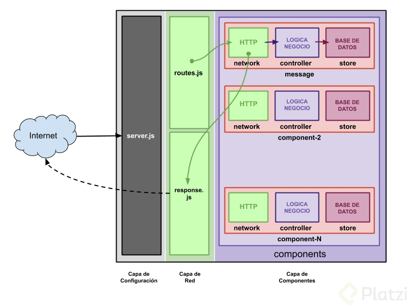

- [Chat con Node y websockets](#chat-con-node-y-websockets)
  - [Peticiones HTTP](#peticiones-http)
    - [Petición HTTP - cliente](#petición-http---cliente)
    - [Respuesta HTTP - servidor](#respuesta-http---servidor)
    - [Puntos clave en la petición HTTP](#puntos-clave-en-la-petición-http)
    - [Métodos, headers, State](#métodos-headers-state)
      - [MÉTODOS](#métodos)
      - [HEADERS](#headers)
      - [States](#states)
    - [Body y query de la petición](#body-y-query-de-la-petición)
      - [Body](#body)
      - [Query](#query)
  - [Crear servidor HTTP con express](#crear-servidor-http-con-express)
    - [Recibir info desde el cliente en el body o query](#recibir-info-desde-el-cliente-en-el-body-o-query)
    - [Leer headers de las peticiones](#leer-headers-de-las-peticiones)
    - [Tipos de respuestas](#tipos-de-respuestas)
      - [Respuestas vacías](#respuestas-vacías)
      - [Respuestas estructurada](#respuestas-estructurada)
      - [Respuestas planas](#respuestas-planas)
    - [Como devolver una repsuesta coherente](#como-devolver-una-repsuesta-coherente)
    - [Servir archivos static](#servir-archivos-static)
  - [Estructura de la applicación que vamos a construir.](#estructura-de-la-applicación-que-vamos-a-construir)
    - [Capa de red y rutas](#capa-de-red-y-rutas)


# Chat con Node y websockets

[Curso Platzi - Chat con Node](https://platzi.com/cursos/nodejs-mongo-websockets/)

## Peticiones HTTP

El protocolo de comunicación HTTP es lo q nos permite transmitir información entre cualquier elemento que esté en la web(servidores, máquinas, clientes,puntos IOT,...)

La petición normalmente tiene estos elementos:

cliente ---> Internet ----> Servidor


### Petición HTTP - cliente

Una petición HTTP puede ser como la siguiente:

- GET /index.html HTTP/1.1 (es importante especificar la versión del protocolo)

otros parámetros incluidos en las cabeceras de la petición, unos ejemplos son:

  - HOST
  - Referer
  - User-agent
  - Connection

### Respuesta HTTP - servidor

La respuesta del servidor suele ser:

- HTTP/1.1 200 ok
- Date
Una serie de cabeceras (headers) como:

  - Content-Type : text/html
  - Content-Length : 1221
  - body: 

### Puntos clave en la petición HTTP

1. MÉTODOS  -> qué quiero hacer (GET/POST/...)
2. ESTADO   -> cómo ha ido la operación
3. CUERPO   -> lo q el servidor devuelve


### Métodos, headers, State


#### MÉTODOS

Es el verbo que utilizaremos al hacer la petición para indicar al servidor qué queremos hacer. Los verbos más utilizados son: 

* GET     -> Recoger información del servidor
* POST    -> añadir información al servidor
* PUT     -> actualizar información del servidor
* PATCH   -> cuando actualicemos solo una parte de la información (pej cambiar foto del user)
* DELETE  -> eliminar info del server
* OPTIONS -> pedir al server infor sobre los métodos que puedo usar

#### HEADERS

Van a darnos información contextual de la petición, es decir cómo quiero hacer la acción que indica el verbo. 

Cuando realizamos un `POST/PUT/PATCH` las que podemos encontrar son las de:

- **Authorization**
Se usa para autenticación y para asegurarnos que podemos pedir "cosas" al server. Esta cabecera te identifica ante el servidor para que éste reconozca si tienes permisos o no para ciertas peticiones de información

- **Cache**

Almacenamiento temporal, esta cabecera gestiona durante cuánto tiempo la respuesta será la misma, por ejmpl si pedimos una foto con una url concreta ésta no modificará en tiempo por lo q podemos pedirle al cliente q la guarde en memoria así cuando la vuelva a solicitar no será necesario que envia otra petición al server. Ahorramos carga al server.
Para ello utilizamos las cabeceras `Cache-control` o `Expires`. 


- **Indicaciones**
- **Condiciones**

- **Cors** (Cross Origin Resource Sharing)
Es lo q gestiona la compartición de recursos entre distintos orígenes. Es si podemos o no manejar información de fuera de nuestro servidor (Access-Control-Allow-Origin). Por ejemplo tenemos una API q la consume un frontend, entonces tenemos que gestionar que urls pueden consumir esa API.

- **Cookies**   
Sirve para compartir info entre peticiones, pej guardar el usuario en una cookie y compartirlo en cada petición.

- **Accept**
Nos define el tipo de contenido que accepta el servidor, porej que le podamos mandar un JSON, XML,... o que me venga la petición en un charset concreto (Accept-Charset, Accrpt-Encoding,...)


#### States

Código que indica lo que ha pasado con la petición. Si se aceptó la petición, si fue rechazada o si se rediregió,...

pueden ser: 

200 -> ok
201 -> created

301 -> moved permanently
304 -> not modified

Los errores se dividen en dos partes 

- errores del cliente (el código lo devuelve el server)

400 -> bad request (el cliente ha enviado algo mal en su petición)
401 -> Unauthorized (no sé que usuario eres así q no t puedo dar esa info)
403 -> Forbidden (sé q user eres y no tinees acceso a esta info)
404 -> not found 

- errores del server 

500 -> internal server error

### Body y query de la petición 

En las peticiones tb encontramos lo q es el cuerpo de la petición

#### Body

Es la información que queremos enviar al servidor o la que nos devuelve el server. El formato en el que llega esta información viene especificado en estas dos cabeceras `content-type` y `content-length`. 

Si hacemos una petición a Platzi la respuesta puede ser, posibles content-type:

- text/html -> si me devuelve la web
- text/css  -> si le hemos pedido un archivo de stilos
- application/javascript -> es un tipo de archivo q puede ser ejecutado por eso es application
- image/jpeg
- application/json
- application/xml

Cuando hacemos un POST en el body podemos mandar un json entonces lo especificariamos así:

content-type: application/json

{
    "name":"David"
}

En la response de cualquier método nos puede venir cualquier tipo de archivo (html,css,js,json..)

#### Query

Nos van a permitir añadir información extra a lo q enviamos al server. Por ejemplo solicitar unos datos y añadir q estos datos vengan en un orden en concreto,... Esto se pasa por la url y lo marcamos con un `?` y a continuación un sistema de clave=valor si hay más de una clave-valor las separamos por `&`.

Por ejemplo `https://www.youtube.com/watch?v=HXV3zeQKqGY` vamos a una url watch pero le pasamos un campo v (como un identificador del video a ver)

También nos sirve como una manera de pasarle datos al frontend. Pero hay q tener en cuenta q estos datos se podrán ver en el url, por lo q los datos sensibles nunca irán por parámetros de query siempre en el body de la petición que además si los mandamos x https irán cifrados. 

## Crear servidor HTTP con express


```javascript
const express = require('express')

const app = express()

app.use('/', (request, response) => {

    console.log(`primera conexión cn el server en el puerto 3000`);
    response.send('hola')

})

app.listen(3000);
```
Pero en este momento el servidor no distingue entre verbos http y siempre devuelve lo mismo envies una petición GET POST .... Así que lo primero que haremos es definir el routter de express y gestionaremos las rquest con el router

```javascript
const express = require('express')
const router = express.Router()

const app = express()

app.use(router);

router.get('/', (req, res) => {
    res.send('hola desde get')
})

router.post('/', (req, res) => {
    res.send('hola desde post')
})


app.listen(3000);
```

### Recibir info desde el cliente en el body o query

Para trabajar con el body de la petición debemos instalar el módulo de body-parser. body-parser is an NPM package that **parses** incoming request bodies in a middleware before your handlers, available under the req.body property.

```
npm i body-parser
```
El body se encuentra en la request. Para acceder al body utilizaremos el middleware body-parser, los middleware deben tener un orden x ejm si ponemos antes del mid de router entrará antes en las rutas q configurar el body-parser por lo q no podremos acceder al body. Debería quedar así

```javascript

const app = express()

app.use(bodyParser.json());
app.use(router);

```
En algunas ocasiones no requerimos utilizar json para enviar datos sino una variante como `application/x-www-form-urlencoded`. Este es especialmente útil en formularios HTML.

```javascript

const app = express()

app.use(bodyParser.json());
app.use(bodyParser.urlencoded({extended:false}));
app.use(router);

```
Extended false utiliza la librería `querystring` mientras que true la librería `qs`. La sintaxis de extended:true permite el uso de otras características como rich objects y arreglos codificados dentro del formato URL-encoded.

app.use(bp.json()) looks at requests where the Content-Type: application/json header is present and transforms the text-based JSON input into JS-accessible variables under req.body. 

app.use(bp.urlencoded({extended: true}) does the same for URL-encoded requests. the extended: true precises that the req.body object will contain values of any type instead of just strings.

Una vez hecho esto podremos acceder a los datos del body directamente

```javascript
router.delete('/message', (req, res) => {

    console.log(req.body); // { text: 'hello' }
    console.log(req.body.text); // hello

    res.send('new message added')
})

```

Para trabajar con el query (parámetros pasados por url) en lugar de usar req.body utilizaremos `req.query`. 

```javascript
/*
    url -> localhost:3000/message?name=david&age=38
*/

router.delete('/message', (req, res) => {
    
    console.log(req.query);       //  { name: 'david', age: '38' }
    
    console.log(req.body);       // { text: 'hello' }
    console.log(req.body.text);  // hello

    res.send('new message added')
})

```
Tener en cuenta q todos los datos q nos llegan por HTTP son tipo strings.

### Leer headers de las peticiones

Parta acceder a las cabeceras de una request basta con 

```javascript
router.get('/message', (req, res) => {

    console.log(req.headers);

    res.send('messages List')
})

/*

{
  'user-agent': 'PostmanRuntime/7.29.0',
  accept: '*//*',
  'postman-token': '99b43401-a8eb-49ba-b9a5-991e26f20762',
  host: 'localhost:3000',
  'accept-encoding': 'gzip, deflate, br',
  connection: 'keep-alive'
}
*/
```
Cabeceras a destacar puede ser 

- user-agent      -> nos dice desde dnd se conecta (el browser)
- accept          -> q respuesta acepta
- accept-encoding -> codificacion de la respuesta
- host            -> dnd va dirigida la petición 


No solo las request tienen headers tb podemos devolver headers en la response.

```javascript
router.get('/message', (req, res) => {

    console.log(req.headers);

    res.header({
        "custom-header": "nuestro header custom"
    })

    res.send('messages List')
})

```
### Tipos de respuestas

#### Respuestas vacías

Ante una request x parte del cliente podemos hacer un response sin body y que solo devuelva unas cabeceras custom y un status code.

```javascript
router.get('/message', (req, res) => {

    res.header({
        "custom-header": "nuestro header custom"
    })

    res.status(201).send(); // respuesta vacía
})
```
#### Respuestas estructurada

Podemos devolver objetos complejos

```javascript
router.get('/message', (req, res) => {

    res.header({
        "custom-header": "nuestro header custom"
    })

    res.status(201).send({ 
        error: '',
        body : "creado correctamente " 
    });
})

```

#### Respuestas planas

Podemos devolver texto plano

```javascript
router.post('/message', (req, res) => {

    res.send('new message added') // texto plano
})
```

### Como devolver una repsuesta coherente

Debemos responder de una manera coherente, es decir que todas las response de nuestra API por ejemplo tengan la misma estructura.

Para ello podemos hacer un módulo que sea el encargado de responder las requests.

```javascript
// nuestro modulo de respuesta

module.exports.success = function (req, res, message, statusCode) {


    res.status(statusCode || 200).send({
        error: '',
        body: message
    })

}

module.exports.error = function (req, res, message, statusCode) {

    res.status(statusCode || 500).send({
        error: message,
        body: ''
    })


};
```

y en mi archivo principal importo el nuevo módulo y gestiono las repsonse con el módulo.

```javascript
const response = require('./network/response.js')

router.post('/message', (req, res) => {

    if (req.query.error == 'ok') {
        response.error(req, res, 'error simulado', 401)
    } else {

        response.success(req, res, 'Mensaje creado correctamente', 201)
    }

})

```

### Servir archivos static

Utilizaremos el servidor de statics de express. Este debemos colocarlo al final de nuetsra aplicación.

```javascript
const path = require("path");

app.use(express.static(path.join(__dirname, "public")));
```
Esta configuración me permite indicar a express q los archivos static se encuentran en la carpeta public, por lo q desde las diferentes vistas (html) podré acceder a archivos css, js, imagenes. 


```javascript
router.get('/message', (req, res) => {

    res.header({
        "custom-header": "nuestro header custom"
    })

    res.sendFile(path.join(__dirname, "public/index.html"));
    //response.success(req, res, 'Lista de mensajes');
})

```

y en el html puedo especificar el path al css

```html
<!DOCTYPE html>
<html lang="en">

<head>
    <meta charset="UTF-8">
    <meta http-equiv="X-UA-Compatible" content="IE=edge">
    <meta name="viewport" content="width=device-width, initial-scale=1.0">
    <!-- ya me situa directamente en la carpeta public -->
    <link rel="stylesheet" href="/css/style.css"> 
    <title>Document</title>
</head>
<body>
    <h1>hi from static</h1>
</body>
</html>
```

## Estructura de la applicación que vamos a construir.



1. El primer elemento q recibirás las peticiones será nuestro archivo `server.js`
   1. comprobará q las peticiones son correctas y dejarlas pasar al servidor o rechazarlas
   2. configurar nuestro servidor
      1. BBDD
      2. headers
      3. ...
2. tendremos un archivo q gestiona las rutas `routes.js`
   1. llamará al componente adecuado según la petición
3. tendremos varios componentes por ejemplo componente message (gestionará todas las respuestas del server)
   1. estará estructurado en varios archivos
      1. **network.js**    -> gestionamos los end-points
      2. **controller.js** -> tinene la lógica de la gestión de mensajes 
      3. **store.js**      -> gestionará el guardado de los mensajes en la bbdd
   
   2. todos los componentes q queramos tendrán la misma estructura
4. finalmente un archivo q se encarge de elaborar las respuestas `response.js`, para la respuesta todos los 
   archivos network de cada componente se comunicarán cn el repsonse.js para elaborar el repsonse. Así todas nuestras response seguirán un mismo patrón y tendrán una coherencia

Si no fijamos nuestra app estará estructurada en 3 capas:

1. capa de configuración del servidor
2. capa de red 
3. capa con los componentes


### Capa de red y rutas


