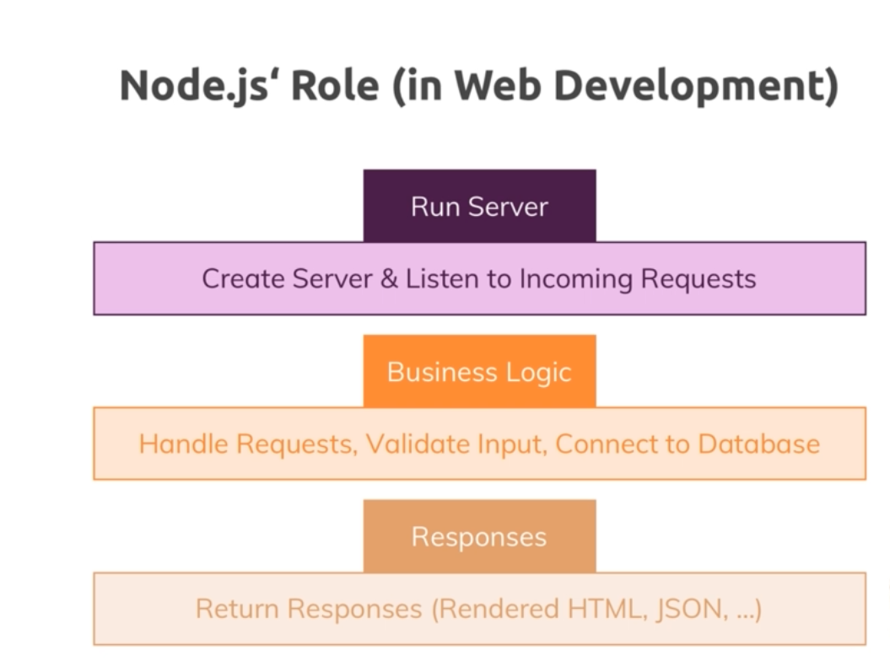
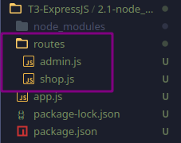
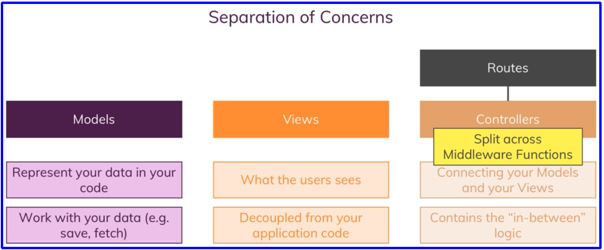

- [NodeJS Course](#nodejs-course)
  - [by Maximillian Academind](#by-maximillian-academind)
- [Introducción](#introducción)
  - [Como funciona la web](#como-funciona-la-web)
  - [Que es NodeJS](#que-es-nodejs)
  - [Que podemos hacer cono node](#que-podemos-hacer-cono-node)
- [T-0 JavaScript Refresh](#t-0-javascript-refresh)
  - [Sintaxi de arrow function](#sintaxi-de-arrow-function)
  - [Uso de la keyword this y utilidad de ()](#uso-de-la-keyword-this-y-utilidad-de-)
  - [Objects properties methods](#objects-properties-methods)
  - [Arrays y sus métodos](#arrays-y-sus-métodos)
    - [Métodos](#métodos)
      - [map()](#map)
      - [slice()](#slice)
      - [splice()](#splice)
      - [filter()](#filter)
      - [foreach()](#foreach)
      - [push pop shift unshift](#push-pop-shift-unshift)
      - [find and findIndex](#find-and-findindex)
  - [new Operators](#new-operators)
    - [spread](#spread)
    - [rest](#rest)
  - [Destructuring](#destructuring)
  - [Async code & Promises](#async-code--promises)
    - [Código síncrono vs asíncrono](#código-síncrono-vs-asíncrono)
    - [Promises](#promises)
- [T-1 NodeJs Basics](#t-1-nodejs-basics)
  - [Instalat nodeJS](#instalat-nodejs)
  - [Creando un servidor con NodeJS](#creando-un-servidor-con-nodejs)
  - [Creación del servidor](#creación-del-servidor)
    - [**request object**](#request-object)
      - [**response object**](#response-object)
      - [Routing request](#routing-request)
    - [Redirectign request & creating a file](#redirectign-request--creating-a-file)
      - [Obtener los datos del body de una request **Streams & Buffers**](#obtener-los-datos-del-body-de-una-request-streams--buffers)
      - [Streams, buffers, pipes and files](#streams-buffers-pipes-and-files)
    - [Lifecycle de un programa NodeJS](#lifecycle-de-un-programa-nodejs)
      - [The Event loop deeper](#the-event-loop-deeper)
  - [Usando el sistema de módulos de NodeJS](#usando-el-sistema-de-módulos-de-nodejs)
- [T2 work flow y debugging](#t2-work-flow-y-debugging)
  - [Entendiendo NPM node package manager scripts](#entendiendo-npm-node-package-manager-scripts)
    - [Instalando paquetes de terceros](#instalando-paquetes-de-terceros)
      - [Paquetes útiles](#paquetes-útiles)
  - [Errors and debugging](#errors-and-debugging)
- [T3 ExpressJS](#t3-expressjs)
  - [Que es expressJS y para qué se utiliza](#que-es-expressjs-y-para-qué-se-utiliza)
  - [Usando express](#usando-express)
    - [Middleware](#middleware)
      - [use](#use)
      - [listen()](#listen)
    - [Manejando rutas](#manejando-rutas)
    - [Parsing incoming request](#parsing-incoming-request)
    - [usando el router de express](#usando-el-router-de-express)
    - [generar 404 error page](#generar-404-error-page)
    - [Filtrar los PATHS](#filtrar-los-paths)
    - [Servir páginas HTML](#servir-páginas-html)
      - [Formas de acceder al path](#formas-de-acceder-al-path)
        - [process.cwd()](#processcwd)
        - [require.main.filename](#requiremainfilename)
        - [dirname](#dirname)
    - [Servir archivos estáticos](#servir-archivos-estáticos)
- [T4 - Trabajando con contenido dinámico y motor de plantillas](#t4---trabajando-con-contenido-dinámico-y-motor-de-plantillas)
  - [Motor de plantillas](#motor-de-plantillas)
    - [Instalación de las plantillas](#instalación-de-las-plantillas)
      - [view engine](#view-engine)
      - [views](#views)
    - [PUG](#pug)
      - [Añadiendo contenido dinámico a la plantilla de pug](#añadiendo-contenido-dinámico-a-la-plantilla-de-pug)
      - [Añadiendo Layouts](#añadiendo-layouts)
      - [Añadir clases css de manera dinámica](#añadir-clases-css-de-manera-dinámica)
    - [HandleBars](#handlebars)
      - [Usando layouts con handlebars](#usando-layouts-con-handlebars)
    - [EJS](#ejs)
- [T-5 Patrón Modelo vista controlador - MVC -](#t-5-patrón-modelo-vista-controlador---mvc--)
- [T-6 Enhancing app](#t-6-enhancing-app)
- [T-7 Dynamic routes and advanced models](#t-7-dynamic-routes-and-advanced-models)
- [T-8 Proyecto-1](#t-8-proyecto-1)
  - [Funciones a tener en cuenta](#funciones-a-tener-en-cuenta)
  - [callbacks - aclaración -](#callbacks---aclaración--)
  - [Proyecto para poner en práctica todo lo aprendido hasta el momento.](#proyecto-para-poner-en-práctica-todo-lo-aprendido-hasta-el-momento)
- [T-9 BBDD y NodeJS](#t-9-bbdd-y-nodejs)
  - [SQL](#sql)
  - [noSQL](#nosql)
  - [SQL](#sql-1)
    - [Instalando MySQL - KDE neon](#instalando-mysql---kde-neon)
    - [INSTALAR MariaDB](#instalar-mariadb)
      - [Configuraciones MARIADB](#configuraciones-mariadb)
    - [creación de un nuevo usuario mysql](#creación-de-un-nuevo-usuario-mysql)
    - [INSTALAR **Dbeaver** - GUI TOOL](#instalar-dbeaver---gui-tool)
    - [INSTALAR mysql](#instalar-mysql)
    - [Errores msql](#errores-msql)
    - [Desinstalar mysql](#desinstalar-mysql)
    - [Usando workbench](#usando-workbench)
    - [Conectar nuestra app a la base de datos SQL](#conectar-nuestra-app-a-la-base-de-datos-sql)
    - [Adaptando nuestra app a la conexión con bbdd](#adaptando-nuestra-app-a-la-conexión-con-bbdd)
- [Sequelize](#sequelize)
  - [conectar sequelize a nuestra bbdd](#conectar-sequelize-a-nuestra-bbdd)
  - [crear modelo con sequelize](#crear-modelo-con-sequelize)
    - [Creación de product model](#creación-de-product-model)
    - [Creación de User model](#creación-de-user-model)
    - [usando el modelo de sequelize](#usando-el-modelo-de-sequelize)
  - [Reescribiendo los controladores](#reescribiendo-los-controladores)
    - [admin controller](#admin-controller)
      - [Crear un nuevo producto](#crear-un-nuevo-producto)
      - [obtener todos los productos de la bbdd](#obtener-todos-los-productos-de-la-bbdd)
      - [obtener un producto por su primary_key](#obtener-un-producto-por-su-primary_key)
      - [update a product](#update-a-product)
      - [delete a product](#delete-a-product)
  - [relaciones o asociaciones con sequelize](#relaciones-o-asociaciones-con-sequelize)
    - [Opciones de los métodos](#opciones-de-los-métodos)
      - [onDelete and onUpdate](#ondelete-and-onupdate)
      - [Customizing the foreign key](#customizing-the-foreign-key)
      - [Asociación obligatoria u opcional](#asociación-obligatoria-u-opcional)
    - [one-to-one](#one-to-one)
    - [one-to-Many](#one-to-many)
    - [Many-to-Many](#many-to-many)
  - [creación de un user (simple)](#creación-de-un-user-simple)
  - [Trabajando en el modelo de cart](#trabajando-en-el-modelo-de-cart)
  - [Eager Loading](#eager-loading)


# NodeJS Course

## by Maximillian Academind

> <span style="font-size:1.5em;"> [_link del curso_](https://www.udemy.com/course/nodejs-the-complete-guide/) </span>

# Introducción
## Como funciona la web

Esta comunicación con el servidor se realiza utilizando unos protocolos, standarización de las rglas que tienen que seguir este tipo de comunicación. Hay varios protocolos pero los más utilizados son HTTP y HTTPs

## Que es NodeJS
Node.js es un entorno de tiempo de ejecución de JavaScript (de ahí su terminación en .js haciendo alusión al lenguaje JavaScript). Este entorno incluye todo lo que se necesita para ejecutar un programa escrito en JavaScript. Es la manera que tenemos de ejecutar JS fuera del navegador.
Node aprovecha el motor V8(engine v8) de google, este permite compilar código JS en código máquina.
Una vez instalado Node en la terminal tecleamos node y entramos en el "REPL"(Read user input, Evaluate user input, Print output, Loop wait for new input), interprete de comandos de node.

Habitualmente Node se usa del lado del servidor.

Aquí tenemos una petición cliente-servidor típica:  


## Que podemos hacer cono node

Podemos construir nuestro propio servidor, aceptar peticiones y crear respuestas en forma de html, datos (json, xml, archivos) y la lógica de negocio



# T-0 JavaScript Refresh


Js es un lenguaje débilmente tipado, podemos usar el paradigma orintado a objetos.

## Sintaxi de arrow function

```javascript
const add2 = (a, b) => {
return a + b;
};

//podemos simplificar en un sola línea
const add = (a, b) => a + b;

// si solo tien un argumento
const addOne = a => a + 1;

// si no tien ningún argumento
const addRandom = () => 1+2;
```
cp

## Uso de la keyword this y utilidad de ()

- This se usa para referirnos a variables o métodos dentro de la misma clase. Si definimos una variable con this dentro de la clase ésta será accesible desde un objeto de esa clase.
Aquí JS tiene algo curioso y es que no solo "this" hace referencia a elementos dentro de la clase si no que también hace referencia al elemento que llama a la función.

```javascript
class NameGeenerator{
    constructor(){
      const btn = document.querySelector('button');
      this.names= ['Desi','Jenni','David']          //asequible a toda la clase
      this.currentName= 0;
      btn.addEventListener('click', this.addName); //acceder a 1 método de la clase
                                                    aquí This hace referencia a la clase
                                                    xq quien llama al constructor es la clase
    }

    addName(){

      const name = new NameField(this.names[this.currentName]); // aquí this hace referencia al elemento que llama a la funcion addName q es el btn
      this.currentName++;

      if(currentName>= this.names.length){
        this.currentName= 0;
      }
    }

  }

  const gen = new NameGeenerator();
```

Para cambiar este comportamiento del this debemos usar el método bind() que fija a que hace referencia el this para esa función

```javascript
btn.addEventListener('click', this.addName.bind(this)); //vuelvo a poner this xq en el
                                                          contexto del contructor quien
                                                          lo llama es la propia clase

```

    Otra manera de solucionar esto es usando funciones anónimas pero aquíi otra vez nos encontramos con el problema del this

```javascript
btn.addEventListener(
  "click",
  function () {
    this.addName();
  }.bind(this)
);

```

Pero la última solución propuesta x ES6 son las arrow function las cuales nos permiten conservar la referencia del this, es como si llamaramos al this fuera de esa función y por lo tanto dentro del constructor.

```javascript
btn.addEventListener("click", () => { this.addName(); } );

```

- () indican que la función debe ser ejecutada de manera inmediata, así dentro de la clase cuando nos queremos referir a un método utilizamos this.nombreMetodo
sin los "()" así sin () lo que hacemos es pasarle la referencia de esa función(la dirección de esa función).

```javascript

class NameField{
  constructor(name){
    const field = document.createElement('li');
    field.textContent = name;
    const nameListHook = document.querySelector('#names');
    nameListHook.appemdChild(field);
}

class NameGeenerator{
  constructor(){
    const btn = document.querySelector('button');
    btn.addEventListener('click', this.addName); // sin () para q no la ejecute inmediatamente
  }

  addName(){
    const name = new NameField('Dav');
  }

}
```

## Objects properties methods

Definir un objeto:

```javascript
  const person = {
    name: "David",
    age: 36,

    greet() {
      console.log("hello from " + this.name);
    },

    greet3: function () {
      console.log("hello from " + this.name);
    },

    greet2: () => {
      console.log("hi" + this.name);

        /* aquí no debemos usar ArrowsFunction xq
          mantiene el scoope del elemento q llama
          a la función y en este caso es el object
          person el cual pertenece al scoope global
          así q no "busca dentro del objeto"*/
    },
  };
```

## Arrays y sus métodos

```javascript
const miArray = ["david", "martin", 36];

for (let items of miArray) {
  // "of" conseguimos los datos
  console.log(items);
}

for (let items in miArray) {
  // "in" conseguimos los índices
  console.log(items);
}
```

### Métodos

#### map()

- Convierte cada elemento del array, conservando el array original y devolviendo otro con los cambios efectuados. Por ejempo añadir a cada item un texto

```javascript
const miArray = ["david", "martin", 36];

//1 línea
let newArray = miArray.map((item, x) => `ìtem ${x}: ${item}`);
//
let newArray2 = miArray.map((item, x) => {
  return `ìtem ${x}: ${item}`;
});

console.log(newArray);//
output: [ 'ìtem 0: david', 'ìtem 1: martin', 'ìtem 2: 36' ]
```

#### slice()

- para copiar arrays su contenido no la referencia así q los arryas serán independientes

```javascript
let shallowCopy = fruits.slice() // this is how to make a copy
```

#### splice()

- Eliminar items

```javascript
let vegetables = ['Cabbage', 'Turnip', 'Radish', 'Carrot']
console.log(vegetables)
// ["Cabbage", "Turnip", "Radish", "Carrot"]

let pos = 1
let n = 2

let removedItems = vegetables.splice(pos, n)
// this is how to remove items, n defines the number of items to be removed,
// starting at the index position specified by pos and progressing toward the end of array.
```

#### filter()

- Nos permite generar un nuevo array siguiendo los criterios del filtro.

```javascript
  const updatedroducts = products.filter((element) => element.id !== id);

```

  del array de productos filtramos aquellos que no tengan un id concreto, útil para el método deete by ID

#### foreach()
- looping arrays

```javascript
fruits.forEach(function(item, index, miArray) {
  console.log(item, index)
})
```
#### push pop shift unshift

- 
```javascript
let fruits = ['Apple', 'Banana']

let newLength = fruits.push('Orange')
// ["Apple", "Banana", "Orange"]

let last = fruits.pop() // remove Orange (from the end)
// ["Apple", "Banana"]

let first = fruits.shift() // remove Apple from the front
// ["Banana"]

let newLength = fruits.unshift('Strawberry') // add to the front
// ["Strawberry", "Banana"]

```

#### find and findIndex

- Nos permite obtener el valor/indice del primer elemento del array que cumple con la condición especificada
obteniendo el índice:

```javascript
const array1 = [5, 12, 8, 130, 44];

let x = array1.findIndex( element => element>5);
console.log(array1[x]); // 12
console.log( x);        // 1

```

    o obtener el valor

```javascript
const array1 = [5, 12, 8, 130, 44];

let x = array1.find( element => element>5);
console.log( x);        // 12

```

    si no encuentra el valor devuelve un `undefined` el índice devuelve un `-1`

## new Operators

### spread

- Permite sacar el contenido(propiedades/métodos/items) de un objeto/array y crear otro objeto/array según rodeemos el spread operator.
Atención no hace un deep copy, es decir si copiamos un array/objeto que contiene otro valor por referencia no crea un nuevo objeto si no q copia la referencia (los métodos no son referencias, se mantiene independientes).

```javascript

  const array1 = ["david", "martin", [36]];
  const arrayCopy = [...array1]; // lo rodeo de "[]" por lo q crea un array
  array1.push("vertgues");

  array1[0] = "david2";
  array1[2][0] = 40;

  console.log(array1);     //  [ 'david2', 'martin', [ 40 ], 'vertgues' ]
  console.log(arrayCopy); // [ 'david', 'martin', [ 40 ] ]

  no añade el último elemento pero sí modifica el array anidado xq copió la referencia, NO hizo uno nuevo
```

    Puedo envolverlo con {} para crear un objeto

```javascript
  const arrayCopy2 = { ...array1 };
  console.log(arrayCopy2); //
    {
    '0': 'david2',
    '1': 'martin',
    '2': [ 40 ],
    '3': 'vertgues'
    }
```

### rest

- Tiene el efecto opuesto a spread, lo que hace es mergear / combinar los argumentos que le pasamos a una función en un array. También son 3 puntitos XD

```javascript
const toArray = (...args) => args;
console.log(toArray(1, 2, 3, 5)); //[ 1, 2, 3, 5 ]

```

## Destructuring

Nos permite obtener los datos de un objeto / array de una manera sencilla. Se puede aplicar tanto a un objeto como a un array.

Le paso un objeto y de ese objeto extraigo la propiedad name y age. Para que funcione tenemos que dar a las variables los mismos nombres que las propiedades del objeto

```javascript
const person4 = {
name: "David",
age: 36,
hobbies: ["nadar", "correr"],
greet() {
  console.log("hello david");
},
};

const printData = ({ name, age }) => console.log(name, age);

```
  También funciona fuera de las funciones y nos permite crear variables con el nombre de las propiedades de los objetos.

```javascript
  const person4 = {
    name4: "David",
    age4: 36,
    hobbies4: ["nadar", "correr"],
    greet4() {
      console.log("hello david");
    }
  };

  const { name4, age4 } = person4;

  console.log(name4, age4);
```

  si queremos dar un nombre diferente de las propiedades a las variables usamos la notación `:`
```javascript
const { name4 : name, age4 } = person4;
```
  Podemos hacer destructuring de arrays y crear variables separadas, en este caso el destruturing se usa "[]" pero NO crea un array

```javascript
  const array4 = ["fruta", "leche"];

  let [item1, item2] = array4;

  console.log(item1, item2);//fruta leche
  //---------------------------------
  let miArray = [
    [1, 2, 3],
    [4, 5, 6],
    [7, 8, 9],
  ];
  function miF([x, y, Z, J]) {
    console.log(x);// [1, 2, 3]
    console.log(y);// [4, 5, 6]
    console.log(Z);// [7, 8, 9]
    console.log(J); //undefined
  }
  miF(miArray);

//------ FUERA DE FUNCIONES

  let [array1, array2, array3] = miArray;
  console.log(array1);
  console.log(array2);
  console.log(array3);
```

## Async code & Promises

### Código síncrono vs asíncrono

Un código síncrono es aquel que se ejecuta línea a línea, es decir un código síncrono es aquel código donde cada instrucción espera a la anterior para ejecutarse.

Un código asíncrono no espera a las instrucciones diferidas y continúa con su ejecución. Por lo general la asincronía permite tener una mejor respuesta en las aplicaciones y reduce el tiempo de espera del cliente.

```javascript
  //asíncrono
  setTimeout(() => {
    console.log("time done!");
  }, 2000);

  //síncrono
  console.log("2");
  console.log("1");
```

el setTimeOut es como un callback, después de 2000 ms se ejecuta la función (el console.log) entonces eso es reconocido por JS y aunque el tiempo sea poco(2 s) primero ejecuta los otros console.log y después vuelve al setTimeOut.

Si tenemos varias funciones asincronas puede ser difícil gestionarlas

```javascript
  //asíncrono
  setTimeout(() => {
    console.log("time done!");
  }, 2000);

  //síncrono
  console.log("2");
  console.log("1");
```

### Promises

Son un objeto de JS que nos permite ejecutar código dependiendo del resultado de otra función. Por ejemplo la concexión a un API para obtener datos si la conexión es exitosa y obtenemos los datos cn la promesa ejecutamos un código y si el servidor devuelve un error ejecutamos otro código distinto.
Las promesas se crean usando un constructor llamado Promise y pasándole una función que recibe dos parámetros, resolve y reject, que nos permiten indicarle a esta que se resolvió o se rechazó.

```javascript
const promise = new Promise((resolve, reject) => {
  const number = Math.floor(Math.random() * 10);

  setTimeout(
    () => number > 5
              ? resolve(number)
              : reject(new Error("Menor a 5"))
    ,1000
  );
});

promise
  .then((number) => console.log(number))
  .catch((error) => console.error(error));
```

---

# T-1 NodeJs Basics

## Instalat nodeJS

Se instalará node y npm

```bash
curl -sL https://deb.nodesource.com/setup_14.x | sudo -E bash -
sudo apt-get install -y nodejs
```

## Creando un servidor con NodeJS

Por defecto Node incluye una serie de módulos, los llamados core modules, algunos ejemplos son:  


Aunque estos módulos están incluidos alguno de ellos no están disponibles de manera global como es el caso del módulo http para ello debemos importarlo usando el keyword **require**

  - require nos permitirá:
      - importar archivos locales, para ello hay que usar un path:
        - absoluto (empezamos x la raíz del sistema de archivos "/")
        - relativo (empezamos x donde se encuentra el archivo "./")
      - importar un **global module** para ello no especificamos ningún path, sólo el nombre del módulo.
## Creación del servidor

  1. importamos el global module **http**
```javascript
const http = require("http");
```
  2. usamos el método **createServer()**, como argumento necesita un **requestListener**, es una función tipo callback
         se ejecutará por cada conexión con el servidor (incoming request).
  3. definir los argumentos de la función requestListener, estos argumentos son dos objetos:
   - request => incoming message
   - response => respuesta del servidor  
     La función puede ser creada como función a parte, anónima o usando arrow function.

```javascript
1. Función a parte

  function rqListener(req, res) {}
  http.createServer(rqListener);

2. anónima
  http.createServer(function (req, res) {});

3. arrow funciton
    http.createServer((req, res) => {console.log(req); });
```

  4. el método http.createServer() nos devuelve un objeto del tipo servidor.

```javascript
const server = http.createServer((req, res) => {
              console.log(req);
            });

```

  5. cn el servidor definimos, mediante el método listen(), un puerto y un
   hostname,si corremos en local por defecto es "localhost" así q no haría
   falta ponerlo.
```javascript
server.listen(3000, "localhost");
```

### **request object**

Es un objeto bastante complejo con multitud de información, a destacar:

  1. Headers
     - Es metadata, añadida al request y tb a response. Contiene el host
       
  2. url
  3. method

#### **response object**

Con el objeto response podemos mandar datos de vuelta, para ello utilizamos diferentes métodos:

  1.  **setHeader()**
      Definimos qué tipo de datos vamos a devolver
  2.  **setWrite()**
      No es muy habitual pero nos permite escribir html
  3.  **end()**
      Para indicar que finalizamos la respuesta. siempre tenemos que agregar end() para indicar q se finaliza

```javascript
  const server = http.createServer((req, res) => {

      const url = req.url;

      res.setHeader("Content-Type", "text/html");
      res.write("<html>");>
      res.write("<head><title>My Web</title></head>");
      res.write("<body><h1>Hello world</h1></body>");
      res.write("</html>");
      res.end();
});
```

#### Routing request

Vamos a gestionar las rutas de nuestro servidor, según el end-point el server nos dará una respuesta u otra.A lo cutre pero sería algo así:

```javascript
if (url === "/") {

          res.setHeader("Content-Type", "text/html");
          res.write("<html>");
          res.write("<head><title>My Web</title></head>");
          res.write(
          "<body>
            <h1>Enter massage</h1>
            <form action='/message' method='POST'>
              <input name='message' type='text'></input>
              <button type='submit'>Click Me!</button>
            </form>
          </body>"
          );
          res.write("</html>");
          return res.end();

      }
```

### Redirectign request & creating a file

```javascript
// creamos estas variable como globales, fuera del http.reateServer()
/--------------------------
const fs = require("fs");
const method = req.method;
//--------------------------

if (url == "/message" && method === "POST") {
  const m = "nothing";
  fs.writeFileSync("message.txt", m);
  res.statusCode = 302;
  res.setHeader("Location", "/");
  return res.end();
}

```

#### Obtener los datos del body de una request **Streams & Buffers**

Node gestiona todos los datos del mismo modo, usando streams y buffers, es una manera muy eficiente de gestionar los datos (leer/escribir datos de entrada en una salida secuencial), son usados para leer archivos, comunicaciones en red,...
Básicamente un stream lo que hace es partir los datos en fragmentos lo que hace que sean más manegables y que se puedan empezar a procesar a medida que vamos obteniendo estos fragmentos, en lugar de cargar todos los wdatos en memoria de una vez como se hacía antes.
Es como funcionan las plataformas de "streaming" como youTube, no cargan el vido completo para poder visualizarlo sino que trocean la información y la van mandando a trozos para que estos puedan ser procesados de inmediato y el video se reproduzca al momento, creando así un flujo continuo de datos. El papel del buffer es de contenedor, a medida que vamos obteniendo trozos de datos vamos llenando el buffer(éste tiene una memoria fija), así un buffer contiene fragmentos de datos antes de empezar a procesarlos, cuando este se llena los datos empiezan a ser procesados. En el flujo continuo de datos, los buffers serían como un stop para coger ese conjunto de trozos de datos y empezar a procesarlos.  
  


Para leer los datos del request, en nuestro caso datos enviados por un formulario (POST), en node todo son eventos así que para capturar los datos tenemos que implementar un **event listener** que esté pendiente de un evento tipo data, este evento es disparado por el stream cuando hay un paquete de datos (chunk) disponible, cuando el buffer está lleno, entonces podemos empezar a procesar esa parte de los datos y el stream dispara un evento 'data' y genera un chunk_of_data que es un objeto Buffer, cada uno de estos chunk_of_data los vamos metiendo en un array de tal manera q al finalizar el proceso tendremos un array de buffers. Al finalizar el proceso se emite un evento end (ya no hay más datos disponibles). Capturamos ese evento y mediante el método concat() de la clase buffer generamos un nuevo buffer a partir del array de buffers (body) y como sabemos q la info es tipo string lo casteamos a string

    ```javascript
          const body = [];
          req.on("data", (chunk_of_data) => {
            body.push(chunk_of_data);
          });
          req.on("end", () => {
            const parsedBody = Buffer.concat(body).toString();
            const message = parsedBody.split("=")[1];
            fs.writeFile("message.txt", message, (err)=>{
              res.statusCode = 302;
                res.setHeader("Location", "/");
                return res.end();
            });
          });
    ```
#### Streams, buffers, pipes and files

La manera tradicional de leer un archivo podía ser usando métodos síncronos o asíncronos.

```javascript 
 // Cargamos todos los datos en memoria y luego los leermos
const fs = require("fs");

const data = fs.readFileSync(__dirname + "/data.txt", "utf8");

console.log(`printing data\n ${data}`);
const data2 = fs.readFile(__dirname + "/data.txt", "utf8", (err, data) => {
  console.log(`printing data2\n ${data}`);
});
 
```

Usando streams sería así:

```javascript 
// usando streams, dividimos los datos en chunks y lo leemos poco a poco.

//streams and buffers
const fs = require("fs");

// creando un stream de lectura
const readableStream = fs.createReadStream(__dirname + "/data2.txt", {
  encoding: "utf8",
});
// creando un stream de escritura
const writeableStream = fs.createWriteStream(__dirname + "/copy_of_data2.txt");

readableStream.on("data", (chunk_data_ready) => {
  console.log(`chunk recived`);
  writeableStream.write(chunk_data_ready);
});
  
```

Cuando trabajamos con streams se suele usar pipes (tuberias) que es una manera de enlazar streams.

```javascript
    const body = [];
    req.on("data", (chunk_of_data) => {
      body.push(chunk_of_data);
    });
    req.on("end", () => {
      const parsedBody = Buffer.concat(body).toString();
      const message = parsedBody.split("=")[1];
      fs.writeFile("message.txt", message, (err)=>{
        res.statusCode = 302;
          res.setHeader("Location", "/");
          return res.end();
      });
    });
```

### Lifecycle de un programa NodeJS

En el caso de nuestro servidor(app.js), los pasos son los siguientes:

  1.  Ejecutamos el archivo => node app.js
   
  2.  El motor de node lee el archivo

  3.  Parsea el código, registra las variables y funciones

  4.  Entonces sucede que nuestro archivo se mantiene en ejecución gracias al **event loop**  
       * Event loop es un proceso gestionado por nodeJS que gestiona los callbacks.  
       * Hay que recordar que NodeJS corre en un único hilo (single threat) no se pueden ejectar varios procesos al mismo tiempo(aunque se puede modificar hasta 4 threats)  
       * Event loop está formado por varias partes: 
          * Tenemos un event queue, donde se almacenan los procesos a reaizar
          * cada evento es recogido x el event loop y llevado al thread pool donde es asignado a un hilo
          * En el thread pool hay un max de 4 hilos cuando están ocupados, la event queue se va llenado
          * a medida que van terminando los procesos los hilos se desocupan y event loop va cogiendo nuevos procesos de la cola
          * en nuestro caso (servidor) el event loop se queda continuamente a la escucha de nuevos request.
          *   
           
        **Siendo NodeJS un proceso monohilo como conseguimos el efecto multihilo, para ello nos servimos de las callbacks y del sistema operativo que nos provee de prcesos multihilo, entonces NodeJS recoge la tarea del event queue. pej leer fichero, y solicita al SO que realice esa función y mediante una callback nos avise cuando la haya completado, mientras nuestro hilo sigue su curso y se encuentra otra tarea, conexion cn bbdd, vuelve a solicitar al SO que haga la conexión, y así, si tuvieramos un proceso que requiere mucho poder de computación o el SO no provee ninguna interfaz asíncrona para ese proceso ya no se utiliza al SO si no que tiramos el threadPoll**  
        source: [_link del video_](https://www.youtube.com/watch?v=lGiv0zfdiJA)

#### The Event loop deeper

Cómo ya hemos dicho event loop se encarga de gestionar los callbacks, en el siguiente orden:

* En primer lugar busca si en nuestro código hay **timers** (setTimeOut/setInterval)
* Otros callbacks pendientes tipo I/O-related como leer/escribir archivos, conexiones de red,...en general blocking long taking operation
* en un punto de este proceso nodeJS dejará esta fase, así que si hay más callbacks pospondrá su ejecución hasta el siguiente iteración del loop
* Una vez estas primera operaciones se completen, event loop entra en la fase poll
* Esta fase pull es cuando nodeJS buscará nuevos I/O events
* Si encuentra nuevos IO events hará lo posible por ejecutar sus callbacks de manera inmediata
* Si no es posible pospondrá su ejecución y las registrará como callbacks pendientes.

VOLVER A MIRAR EL VIDEO 14  


## Usando el sistema de módulos de NodeJS

En nodeJS es muy común separar nuestro código en diferentes archivos y luego exportarlos para poderlos usar desde otros archvos y así tener nuestro código más ordenado.  
Podemos crear un nuevo archivo llamado **routes.js** que contendrá los pasos a seguir según la url que le solicitemos al servidor, esto es la función anónima que le pasamos como argumento a **http.createServer()**. Así podemos dejar un archivo con la creación del servidor y un archivo routes dnd encontremoslas urls de éste.
Nuestro punto de partida será el servidor (app.js) y este requerirá el código del archivo routes, para ello desde el archio routes asignamos nuestra función **(req,res)=>{}** a una constamte llamada **requestHandler** para luego poderla exportar.

```javascript
const requestHandler = (req, res) => {
  const url = req.url;
  const method = req.method;
  if (url === "/") {
    res.setHeader("Content-Type", "text/html");
    res.write("<html>");
    res.write("<head><title>My Web</title></head>");
    res.write(
      "<body><h1>Enter massage</h1> <form action='/message' method='POST'> <input name='message' type='text'></input> <button type='submit'>Click Me!</button> </form></body>"
    );
    res.write("</html>");
    return res.end();
  }

  if (url === "/message" && method === "POST") {
    const body = [];
    req.on("data", (chunk_of_data) => {
      body.push(chunk_of_data);
    });
    req.on("end", () => {
      const parsedBody = Buffer.concat(body).toString();
      const message = parsedBody.split("=")[1];
      fs.writeFileSync("message.txt", message, (err) => {
        res.statusCode = 302;
        res.setHeader("Location", "/");
        return res.end();
      });
    });
  }
  res.setHeader("Content-Type", "text/html");
  res.write("<html>");
  res.write("<head><title>My Web</title></head>");
  res.write("<body><h1>hello world</h1> </body>");
  res.write("</html>");
  res.end();
};
 ```

Y esta constante **requestHandler** será lo que exportemos. Lo podemos hacer de varias maneras pero siempre utilizando un objeto global de JS llamada **module** que tiene una propiedad llamada **exports** a la cual le podemos asignar un valor:

1. Almacenar directamente la constante en la propiedad exports
    ```javascript
      module.exports = requestHandler;

      // en app.js podríamos utilizar la constante directamente:
        const routes = require("./routes");
        const server = http.createServer(routes);

    ```
1. exportar como un objeto

    ```javascript
      module.exports = {
        handler: requestHandler,
        text : 'Hello world"
      }
      // en app.js tenemos q acceder a la propiedad de ese objeto:
        const routes = require("./routes");
        const server = http.createServer(routes.handler);

    ```

1. crear propiedades dentro de exports

    ```javascript
      module.exports.handler= requestHandler;
      module.exports.text= 'hello world';

      // en app.js tenemos q acceder a la propiedad de ese objeto:
        const routes = require("./routes");
        const server = http.createServer(routes.handler);

    ```

Una vez hecho esto desde nuestro archivo app.js podemos importar los datos contenido en esa propiedad **exposrts** mediante un **require** y almacenar los datos en una constante. Como estamos importando un módulo que no es global necesitamos especificar el path por ello:

```javascript
  const routes = require("./routes");
```

# T2 work flow y debugging

## Entendiendo NPM node package manager scripts

Es un gestor de paquetes para NodeJS que se instala automáticamente cuando instalamos NodeJS. Este nos permitirá instalar paquetes de terceros no incluidos en el core de NodeJS.
Podemos usar npm para empezar un nuevo proyecto de NodeJS. En el directorio del proyecto tecleamos en la terminal:

```
  npm init
```

Esto nos guiará por un asistente para que completemos información sobre nuestro proyecto. Esto generará un archivo **package.json** (archivo de configuración de nuestro proyecto).

```javascript
  {
    "name": "2.1-node_server",
    "version": "1.0.0",
    "description": "",
    "main": "app.js",
    "scripts": {
      "test": "echo \"Error: no test specified\" && exit 1"
    },
    "author": "David Martin",
    "license": "ISC"
  }
```

Gracias a este archivo de configuración nos podemos llevar nuestro proyecto a otro pc y para instalarlo (dependencias) podemos hacer

```
npm install
```

Y tendremos nuestro proyecto listo

En este archivo hay una sección de scripts, en la cual podemos definir scripts propios.

1. start  
Este es el nombre de un script predefinido así que se ejecuta directamente **npm start** Nos permite ejecutar un comando para inicializar nuestro proyecto. Esto se utiliza cuando alguien externo quiere ejecutar nuestro proyecto y no sabe el punto de partida se suele poner "npm start" para que se ejecute.

Puede que al ejecutar **npm start** si no tenemos instalado nodemon de antemano nos de error, así que mejor instalar nodemon y después ejecutar npm start

```javascript
  {
    "name": "2.1-node_server",
    "version": "1.0.0",
    "description": "",
    "main": "app.js",
    "scripts": {
      "test": "echo \"Error: no test specified\" && exit 1",
      "start": "node app.js"
    },
    "author": "David Martin",
    "license": "ISC"
  }
```
2. custom name
Para ejecutar un scrip con un nombre puesto por nosotros debemos teclear:

```
npm run nombreScript
```

### Instalando paquetes de terceros

  
      
NPM repository es donde se almacenan los paquetes de terceros y mediante comandos de npm podemos instalarlos en nuestro proyecto y utilizarlos como dependencias del mismo lo que llamamos **paquetes de producción** o también hay paquetes que nos ayudan durante el desarrollo **paquetes de desarrollo**.

Así cuando instalamos un paquete hay que decidir de que tipo es, si es dependencia de desarrollo lo instalamos como

```
npm install nombrePackage --save-dev
```

Si queremos instalarlo como dependencia de producción es

```
npm install nombrePackage --save
```

De ambas maneras solo lo instala en nuestro proyecto, si queremos instalar un paquete de manero global usamos -g

```
npm install -g nombrePackage
```

#### Paquetes útiles

1. ##### nodemon
   - Nos permite reiniciar nuestro servidor cuando modificamos el código. Para instalarlo

```
  npm install nodemon --save-dev
```
      Podemos crear una archivo, nodemon.json, en la raiz del proyecto para configurar que ignore algunos archivos

```javascript
  {
    "ignore": ["*.json"]
  }
```

        Así solo lo instalamos de manera local (solo nuestro proyecto). Nos crea en nuestro proyecto una carpeta **node_modules** donde se instalan estos paquetes.
        Para usarlo tenemos que ejecutar el proyecto mediante nodemon no usando node

```javascript
  {
    "name": "2.1-node_server",
    "version": "1.0.0",
    "description": "",
    "main": "app.js",
    "scripts": {
      "test": "echo \"Error: no test specified\" && exit 1",
/*=>*/  "start": "nodemon app.js" // <==
    },
    "author": "David Martin",
    "license": "ISC",
    "devDependencies": {
      "nodemon": "^2.0.6"
    }
  }
```

## Errors and debugging

Hay tres categorias de errores:

- sintaxis  
  Tiempo de ejecución => nuestro programa tiene algún error que impide que se ejecute  
  Errores de lógica => el programa se ejecuta pero no funciona como se esperaría.

# T3 ExpressJS

## Que es expressJS y para qué se utiliza


Express es un framework que nos permitirá despreocuparnos de tareas tediosas, como extraer el body de la request, crear servidor, routing,... y centrarnos en la lógica.
Por ejemplo para extraer el body de la request teníamos q escuchar el event data recorrer el buffer, detectar el event end y parsear la info a string si la info era un string... con express todo eso se simplifica.

## Usando express

1. Instalamos express

```
  npm install express --save
```
2. importamos en nuestro app.js

```javascript
const express = require('express');
```

3. creamos una app cn express y arrancamos el server

```javascript
const app = express();

const server = http.createServer(app);

server.listen(3000);
```

### Middleware


Express funciona con middlewares, es un conjunto de funciones a través de las cuales es conducida una request al servidor. Estos middlewares son requestHandlers mediante los cuales podemos agregar funcionalidades a nuestro servidor, son funciones que establecemos entre la entrada de la request y el envío de la respuesta.

#### use

- Es un método sobrecargado por lo que tenemos varias implementaciones del mismo.
Para cada request entrante se ejecutará el método use(), a éste le pasamos tres argumentos request,response y **next**.

  - **Next()**
    es una función que debemos ejecutar al final de nuestro código para permitir el avance hacia el siguiente middleware. Excepto cuando enviemos una respuesta.
  - **send()**
    Nos permite enviar una respuesta y de manera automática exprees detecta qué tipo de respuesta es y le completa el header.  

    

#### listen()

- Esta función sustituye a la creación del servidor.

```javascript
const server = http.createServer(app);
server.listen(3000, "localhost");
```

  podemos escribir directamente

```javascript
app.listen(3000);
```

### Manejando rutas

Podemos usar el middleware use() para especificar la url. Si solo especificamos en la ruta "/" como todas las url empiezan por '/', si queremos acceder a una url q no existe en nuestro servidor pej
/random como el único elemento que coincide es / se dirigirá ahí. Las diferentes rutas siempre tienen que ir por encima de la principal "/". Para evitar esto podemos utilizar get(), post(),... ya que con estos métodos sólo se dirigirá si la url es exactamente igual.

```javascript
app.use("/add-product", (req, res, next) => {
  console.log("in the middleware");
  res.send("<h1>Add-product page</h1>");
}); //middleware

app.use("/", (req, res, next) => {
  console.log("in the other middleware");
  res.send("<h1>Hello from express</h1>");
}); //middleware

```

### Parsing incoming request

Para gestionar los request usamos el middeware use() de la siguiente manera.

1. body-parser y urlencoded()
    Es una paquete externo que instalamos en desarrollo que nos ayudará a parsear el contenido del body. Funciona solo para parsear datos codificados en la url por lo tanto tipo string, datos que vienen de un formulario, si enviamos tipo json o archivos usaremos otro tipo de **body-parser**.
    Como hemos dicho antes use() se ejecuta para cada request así q body-parser se ejecutará en cada conexión y si hay datos en la url los decodificará, lleva implícito un next() por lo que permitirá ejecutar el código que le sigue.

    ```
      npm install body-parser --save

    ```

    Una vez instalado lo importamos y especificamos que queremos decodificar las url usando el método urlencoded()
    tenemos que añadirle la opción extended en:

    * false si los datos codificados en la url serán de tipo string o array
    
    * true si serán de cualquier tipo
```javascript
const bodyParser = require("body-parser");

const app = express();
//parsear el request body
app.use(bodyParser.urlencoded({ extended: true }));

```
      Para hacer que la ruta (/product) solo sea accesible mediante una petición tipo POST
      el método use() es genérico, reacciona a cualquier request si queremos filtrar r get o post debemos usar
        app.get()  
        app.post()  
        app.delete()  
        app.push()  
        app.put()  

  ```javascript
  app.post("/product", (req, res, next) => {
    console.log(req.body);
    res.redirect("/");
  });
```

### usando el router de express

La función Router() crea como una mini app de express asociada a nuestra app que nos ayuda a gestionar las rutas. Creamos una carpeta Routes y dentro ponemos nuestroas archivos para las rutas, normalmente se pone uno para las rutas a las q puede acceder el admin y otro genérico.



```javascript
  const express = require("express");

  const router = express.Router();

  router.get("/add-product", (req, res, next) => {

    res.send(
      "
      <body>
        <h1>Add-product</h1>
          <form action='/product' method='POST'>
            <input name='title' type='text'></input>
            <button type='submit'>add produc t!</button>
          </form>
      </body>
      "
    );
  });

  router.post("/product", (req, res, next) => {
    console.log(req.body);
    res.redirect("/");
  });

  router.module.exports = router;
```

después importamos nuestro archivo a la app.js.

```javascript
const express = require("express");
const bodyParser = require("body-parser");

const app = express();

const adminRoutes = require("./routes/admin");

app.use(adminRoutes);
```

### generar 404 error page

Para generar una respuesta ante una url que no existe usamos

```javascript
//------------ FIN IMPORTS ----------------
app.use(adminRoutes);
app.use(shopRoutes);

app.use((req, res, next) => {
  res.status(404).send("<h1>Page not found</h1>");
});

app.listen(3000);

```

### Filtrar los PATHS

Es habitual en las apps que las url se filtren por usuario, por ejemplo "/admin/add-product" o "/admin/products" y así. Si tenemos configurado nuestros paths de esa manera podemos añadirlo a use() de la siguiente manera:

```javascript
  app.use("/admin", adminRoutes);

```

de tal modo que solo las url que empiezan por /admin entraran en el adminRoutes. Pero una vez dentro del archivo no debemos volver a chequear la ruta entera "/admin/add-product" solo mira a partir de
"/admin/"

```javascript
// /admin/add-product => GET

router.get("/add-product", (req, res, next) => {

  res.send(
    "<body><h1>Add-product</h1> <form action='/admin/add-product' method='POST'> <input name='title' type='text'></input> <button type='submit'>add produc t!</button></form></body>"
  );
});

// /admin/add-product => POST

router.post("/add-product", (req, res, next) => {

  console.log(req.body);
  res.redirect("/");
});
```

### Servir páginas HTML

#### Formas de acceder al path

##### process.cwd()

- Esta función es una manera de conocer la ruta absoluta donde se encuntra nuestro proyecto:

```javascript
console.log(process.cwd())
/home/david/Programacion/WEB-DEVELOPMENT/NodeJs/code/T5-MVC/5.1-eJS-node-server
```

##### require.main.filename

- Sustituye a process.mainModule.filename, y como este nos da el nombre del archivo donde empieza nuestra app, el que arranca la aplicación.

```javascript
console.log(require.main.filename);
/home/david/Programacion/WEB-DEVELOPMENT/NodeJs/code/T5-MVC/5.1-eJS-node-server/app.js

```

##### dirname

- Nos da la ruta absoluta hasta el archivo donde ejecutamos `__dirname`

```javascript
console.log(__dirname);
/home/david/Programacion/WEB-DEVELOPMENT/NodeJs/code/T5-MVC/5.1-eJS-node-server/controllers

```

  Creamos un directorio llamado views dnd guardaremos nuestras págias HTML.
  Para poderlas devolver en la respuesta usamos el método sendFile() y especificamos la ruta a nuestras vistas. Para especificar el PATH tenemos un core module que nos ayuda con eso.

```javascript
  const path = require("path");

  router.get("/", (req, res, next) => {

      res.sendFile(path.join(__dirname,"..", "views", "shop.html"));

  });
```
    usamos el método join() para ir encadenando porciones de la ruta hasta llegar a nuestro archivo. la variable global **__dirname** hace referncia a la ruta desde la raíz de nuestro SSOO hasta el archivo donde escribimos __dirname, una vez ahí vamos completando la ruta. En nuestro caso tenemos q entrar en una carpeta hermana de la q ejecutamos el código así q tenemos q concatenar
    "..".

### Servir archivos estáticos

Servir archivos estáticos significa poder servir archivos que no esté gestionado por el sistema de router de express u otro middleware si no que se accede directamente por el sistema de archivos.
En principio NodeJS bloquea el acceso al sistema de archivos pero para que el html puede acceder a una hoja CSS necesitamos hacer una excepción.
Para ello necesitamos otro middleware usando el propio objeto de express

```javascript
app.use(express.static(path.join(__dirname, "public")));
```

De este manera hará que todo el contenido del directorio **public** sea accesible.
Cuando intentemos acceder desde el HTML para cargar el css el sistema ya situa la ruta en el directorio especificado "public" así que en el tag link ponemos

```html
<link rel="stylesheet" href="/css/main.css" />
```

**No hay que dejarse la "/" antes de css IMPORTANTE!!!**
Lo que hace express es que cualquier request que solicite un archivo terminado en .css, .js, imágenes, etc.. lo edirigirá al directorio especificado como archivos státicos, en nuestro caso el diretorio public.

Mediante el mismo método podemos registrar varios directorios como fuentes de archivos estáticos.

# T4 - Trabajando con contenido dinámico y motor de plantillas

Hasta ahora hemos parendido a servir contenido estático lo que no es muy usual, lo habitual es que podamos modificar el contenido de nuestros HTML de manera dinámica, por ejemplo recuperando info de nuestra BBDD.
Para simular una bbdd usaremos una array, el problema de esto es que el array es "heredado" en node para todos los usuarios que se conecten al servidor, lo que ocasiona que si un usuario modifica la info el otro tb verá esas modificaciones, lo que no es una implementación que se deba hacer, pero xa aprender a usar el motor de plantillas está bien.

Entonces en adimin creamos el array y lo exportamos:

```javascript
const express = require("express"),
path = require("path");

const router = express.Router();

//----variable donde guardaremos info a modo de bbdd
const products = [];

// /admin/add-product => GET
router.get("/add-product", (req, res, next) => {
    res.sendFile(path.join(__dirname, "..", "views", "add-product.html"));
});
// /admin/add-product => POST
router.post("/add-product", (req, res, next) => {
  products.push({ title: req.body.title });
  res.redirect("/");
});

module.exports.routes = router;
module.exports.products = products;
```

## Motor de plantillas


Motores de platillas hay muchos pero veremos los 3 más usados. Todos ellos se integran a la perfección con express, es más es más fácil usarlos con express, solo necesitamos "decirle" a express que usaremos un motor de plantillas


### Instalación de las plantillas

1. Instalamos con npm los paquetes

```
    npm install ejs pug express-handlebars --save
```

2. Coonfiguramos express para que use el motor de plantillas, para ello usamos método set() para establecer una configuración global. También podemos usar set() para establecer datos de manera global (accesible en toda la app), estos datos siempre son parejas llave-valor. Hay lgunas llaves preestablecidas como el caso q nos interesa **"views"** y **"view engine"**.

#### view engine
Le dice a express que para renderizar vistas dinámicas utilice el motor de plantillas especificado.
#### views
Le dice a express donde encontrar las plantillas dinámicas. Por defecto las coge en la ruta "/views"

```javascript
// datos globales
app.set("miNombre","David");
app.get("miNombre");//"David"

// establecer plantillas.

const app = express();

app.set("view engine", "pug");
app.set("views", "Templates");

```

### PUG

Es un motor que usa una versión simplificada de HTML, es muy importante respetar la identación, podemos usar css enlazados pero para aplicar una clase css a un tag HTML se utiliza la notación de punto

```pug
<!DOCTYPE html>
html(lang="en")
  head
    meta(charset="UTF-8")
    meta(name="viewport", content="width=device-width, initial-scale=1.0")
    title My Shop
    link(rel="stylesheet", href="/css/main.css")
    link(rel="stylesheet", href="/css/main-product.css")
  body
    header.main-header
      nav.main-header__nav
        ul.main-header__item-list
          li.main-header__item
            a.active(href="/") Shop
          li.main-header__item
            a.active(href="/admin/add-product") Add Product
```

Para renderizar la vista debemos usar el método render(), como anteriormente ya definimos dónde guardábamos las platillas dinámicas no hace falta especificar la ruta

```javascript
  router.get("/", (req, res, next) => {

    res.render("shop");

  });

```

#### Añadiendo contenido dinámico a la plantilla de pug

Para pasar datos a la plantilla simplemente debemos agregárselos como segundo argumento de la función render(); en forma de objeto(clave-valor)

```javascript
  const products = require("./admin").products;
  //---------------------------------------------

  const router = express.Router();

  router.get("/", (req, res, next) => {

    res.render("shop", { items: products, docTitle: "Shop" });
  });

```

Para recuperar esos datos en la plantilla de pug usamos la sitaxi  
`# { }`
Recordemos que en la clave items tenemos un array (products) que contiene objetos del tipo {title:''} Entonces solo tendremos que iterar el array e ir sacando el título de cada producto

```pug
<!DOCTYPE html>
html(lang="en")
head
  meta(charset="UTF-8")
  meta(name="viewport", content="width=device-width, initial-scale=1.0")
  title #{docTitle}
  link(rel="stylesheet", href="/css/main.css")
  link(rel="stylesheet", href="/css/main-product.css")
body
  header.main-header
    nav.main-header__nav
      ul.main-header__item-list
        li.main-header__item
          a.active(href="/") Shop
        li.main-header__item
          a.active(href="/admin/add-product") Add Product
  main
    if items.length > 0
      div.grid
          each item in items
            article.card.product-item
                header.card__header
                    h1.product__title #{item.title}
                div.card__image
                    img(src="https://cdn.pixabay.com/photo/2016/03/31/20/51/book-1296045_960_720.png",
                    alt="A Book")
                div.card__content
                    h2.product__price $19.99
                    p.product__description A very interesting book
                div.card__actions
                    button.btn Add to Cart
    else
      h1 No products
```

Un formulario quedaría así

```pug
  main
    form.product-form(action="/admin/add-product",method="POST")
        div.form-control
          label(for="title") Title
          input(type="text", name="title", id="title")
        button.btn( type="submit") Add Product

```

#### Añadiendo Layouts

Si en todas nuestras páginas tenemos una estrctura similar, como nos sucede a nosotros con el header podemos hacer layouts en lugar de volver a escribirlo.
Estos layuots podemos personalizarlos para que se ajusten a cada situación, por ejemplo hay páginas que tendrán unos estilos css diferentes, un contenido concreto,... así para crear un layout (esqueleto) y poder añadir elementos usamos los bloques `block`

```pug
<!DOCTYPE html>
html(lang="en")
  head
    meta(charset="UTF-8")
    meta(name="viewport", content="width=device-width, initial-scale=1.0")
    title #{title}
    link(rel="stylesheet", href="/css/main.css")
    block styles
  body
    header.main-header
      nav.main-header__nav
        ul.main-header__item-list
          li.main-header__item
            a(href="/") Shop
          li.main-header__item
            a(href="/admin/add-product") Add Product
    block content

```

Lo mejor para guardar los layouts es en la misma carpeta donde tenemos las plantillas.


Una vez hecho esto en la plantilla deseada utilizando la palabra reservada `extends`
importamos el layout y con `block` inyectamos el contenido que queramos

```pug
  extends layouts/main-layout.pug

  block content
    h1 Page not found
```

#### Añadir clases css de manera dinámica

Para ello podemos enviar un nuevo argumento en el método render() para saber si debemos añadir la clase o no.

```javascript
  router.get("/add-product", (req, res, next) => {

    res.render("add-product", {

      pageTitle: "Add-Product",
      path: "/admin/add-product",

    });
  });

```

luego comprobamos con un `if` en la plantilla

```pug
  a(href="/admin/add-product", class= (path=== '/admin/add-product' ? 'active' : '')  ) Add Product
```

### HandleBars

Este otro motor de plantillas usa HTML mezclado con código para generar la lantilla. Así que en app.use() modificamos nuestro motor pero handlebars no está incluido en el core así que tenemos q importarlo previamente y decirle a express que es un motor de plantillas

```javascript
const expressHbs = require('express-handlebars');//importamos

app.engine("hbs", expressHbs()); // lo registramos como motor de plantillas
app.set("views", "Templates");
app.set("view engine", "hbs");

```

Para renderizar la página tenemos que especificar q no usamos layouts porque por defecto handlebars se construye con un esquelo principal al que le vamos añadiendo cosas, entonces busca primero un main.handlebars.
Busca por este árbol de directorios    


```javascript
  app.use((req, res, next) => {
    res
      .status(404)
      .render("404", { layout: false, pageTitle: "Page not found2" });
  });
```

Luego podemos modificar varios valores con los que trabaja handlebars por defecto

```javascript
  app.engine("handlebasrs", expressHbs({
          layoutsDir: path.join(__dirname, "Templates","layouts"),
          partialsDir: path.join(__dirname, "Templates","layouts","partials"),
          extname: "hbs",
          defaultLayout: 'main',
    })
  );
```

Una de las diferencias con pug es que en una plantilla de handlebars no podemos usar lógica, es decir evaluar con un if
`if items.length > 0 ...` sólo podemos pasarle variables con datos.
Así que la lógica la tenemos que tener en nuestro nodeJS pasarle a la plantilla el resultado

```javascript
router.get("/", (req, res, next) => {
  res.render("shop", {
    layout: false,
    pageTitle: "Shop - handlebars",
    items: products,
    hasProducts: products.length > 0,
  });
});
```

una vez sabemos si tenemos productos evaluar con if en la plantilla, cuando hacemos un loop con `each` podemos acceder a cada elemento dentro de la iteración con `this`

```handlebars
  {{#if hasProducts}}
          {{#each items}}
            <div class="grid">
                <article class="card product-item">
                    <header class="card__header">
                        <h1 class="product__title">{{this.title}}</h1>
                    </header>
                    <div class="card__image">
                        
                    </div>
                    <div class="card__content">
                        <h2 class="product__price">$19.99</h2>
                        <p class="product__description">A very interesting book about so many even more interesting things!</p>
                    </div>
                    <div class="card__actions">
                        <button class="btn">Add to Cart</button>
                    </div>
                </article>
            </div>
          {{/each}}
        {{else}}
          <h1>Not found products</h1>
        {{/if}}

```

#### Usando layouts con handlebars

Tenemos que especificar dónde están guardadas los layouts y como se llama el layout por defecto

```javascript
  app.engine(
    "hbs",
    expressHbs({
      defaultLayout: "main-layout",
      layoutsDir: path.join(__dirname, "Templates", "layouts"),
      extname: "hbs",
    })
  );

```

Creamos nuestro layout, en la regióm `{{{body}}}` es donde inyectará la página que estamos renderizando

```handlebars
  <!DOCTYPE html>
  <html lang="en">
    <head>
      <meta charset="UTF-8" />
      <meta name="viewport" content="width=device-width, initial-scale=1.0" />
      <meta http-equiv="X-UA-Compatible" content="ie=edge" />
      <title>{{pageTitle}}</title>
      <link rel="stylesheet" href="/css/main.css" />
      {{#if formsCss}}
        <link rel="stylesheet" href="/css/forms.css" />
      {{/if}}
      {{#if productCss}}
        <link rel="stylesheet" href="/css/main-product.css" />
      {{/if}}
    </head>

    <body>
      <header class="main-header">
        <nav class="main-header__nav">
          <ul class="main-header__item-list">
            <li class="main-header__item"><a class= " {{#if activeShop}}active{{/if}}" href="/">Shop</a></li>
            <li class="main-header__item">
              <a class= "{{#if activeAddProduct}}active{{/if}} " href="/admin/add-product">Add Product</a>
            </li>
          </ul>
        </nav>
      </header>
      {{{body}}}
    </body>
  </html>

```

Una vez hecho esto en shop.js queda así

```javascript
router.get("/", (req, res, next) => {
res.render("shop", {
  productCss: true,
  activeShop: true,
  pageTitle: "Shop - handlebars",
  items: products,
  hasProducts: products.length > 0,
});
});
```

### EJS

Es parecido a Pug por lo q no necesitamos registrarlo como motor de plantillas. No es compatible con layouts.  
Para crear la plantilla podemos usar HTML

```
<%= %> nos permite renderizar el contenido de una variable como si fuera un string

<%  %> en medio podemos incluir código JS
<%- %> permite renderizar código como HTML o  hacer includes
      <%- include('../includes/navigation.ejs') %>

```

Si quisiera pasar algún dato al include uso un segundo argumento

  **mirar la sintaxis de los archivos del T4**

# T-5 Patrón Modelo vista controlador - MVC -

Es un patrón de diseño que separa nuestro código en diferentes partes, cada una de ellas tiene una función concreta. Nuestra app está formada por tres partes:

- **modelo** => es la parte responsable de la gestión de los datos.
- **la vista** => se encarga de mostrar el contenido al usuario.
- **el controlador** =>responsable de conectar el modelo con las vistas, controla qué vista se renderiza, las rutas y que modelo se usa.



**mirar código del T5**
En el archivo 'T5-MVC/5.1-eJS-node-server/model/product.js' cuando leemos el archivo para almacenar los productos lo podemos hacer directamente (readFile()) o si el archivo es muy grande leerlo como un stream (a trozos).

- Refectoring usando una helper function que lea el archivo bbdd.

```javascript
const fs = require("fs"),
  path = require("path");

const path_to_bbdd_file = path.join(
  process.cwd(),
  "data",
  "products_bbdd.json"
);
//---------helper function
const getProductsFromFile = (cb) => {
  fs.readFile(path_to_bbdd_file, (err, data) => {
    if (err) {
      cb([]);
    } else {
      cb(JSON.parse(data));
    }
  });
};
//-----------------------
module.exports.classProduct = class Product {
  constructor(title) {
    this.title = title;
  }
  save() {
    getProductsFromFile((products_data) => {
      products_data.push(this);
      fs.writeFile(path_to_bbdd_file, JSON.stringify(products_data), (err) => {
        if (err) console.log(err);
      });
    });
  }
  static fetchAll(cb) {
    getProductsFromFile(cb);
  }
};
```

  

# T-6 Enhancing app

`mirar el código`

# T-7 Dynamic routes and advanced models


- Extraer con Router() datos de la url, para ello en el router usamos la siguiente nomenglatura

```javascript
router.get("/products/:productId", shopController.getProduct);
```

Si tenemos otro segmento statico en la ruta `/products/` como por ejemplo `/products/delete` y lo ponemos detrás de la url con segmento dinámico express no podra acceder, es decir en este orden

```javascript
//-- ESTO NO FUNCIONA BIEN !!!!!!

//url con segmento dinámico marcado por  ":"
router.get("/products/:productId", shopController.getProduct);
router.get("/products/delete", shopController.deleteProduct);

```

Este sería el orden correcto!

```javascript
//-- ORDEN CORRECTO !!!!!!

//url con segmento dinámico marcado por  ":"
router.get("/products/delete", shopController.deleteProduct);
router.get("/products/:productId", shopController.getProduct);

```

Recordar que para pasar datos por post podemos usar el `req.body` o meter la info en la url como un `segmento dinámico (/products/:id)` y recogerlo como req.params.id

- Query params
  Son los datos que pasamos por la url, se indican a partir de un `? ` en la url y si pasamos más de uno van separados por `&`
  ```
    http://localhost:3000/admin/edit-product/0.12?myParam=true&title=book
  ```
  Hay que tener en cuenta que los datos extarídos así siempre son del tipo `string`
  Para extraerlos:
  ```javascript
    req.query.myParam
  ```
  Si no se encuentra el parámetro que buscamos nos devuelve `undefined`

# T-8 Proyecto-1

## Funciones a tener en cuenta
- Usaremos funcionalidades importantes de los arrays como:
  - .find()
  - .findIndex()
  - .filter()

## callbacks - aclaración -
Es cuando pasamos una función como argumento de otra función, la clave aquí es q la función externa "decide" cuando se eecuta la función pasada (callback). Ponemos de ejemplo la funión de lectura y escritura en n archivo
```javascript
const getProductsFromFile = (cb) => {
  
  fs.readFile(path_to_bbdd, (err, data) => {
    if (err) {
      cb([]);
    } else {
      cb(JSON.parse(data));
    }
  });
}; 
```
La función getProductsFromFile recibe un callback que lo ejecutará cuando haya leído el archivo, pasándole los datos del archivo o un array vacío [].
Entonces cuando yo ejecuta esta función le paso la implementación del callback

```javascript
    getProductsFromFile((products_from_file) => {

      products_from_file.push(this);

      fs.writeFile( path_to_bbdd,
                    JSON.stringify(products_from_file),
                    (error) => {
                        if (error){
                            console.log(error);
                          }
        }
      );

    });
```
Primero lee el archivo:
- si da un error ejecuta la arrow function que le estoy pasando y le pasa como argumento un array vacío []
- si obtiene datos se los pasa
La arrow function que le paso escribe los datos en un archivo


## Proyecto para poner en práctica todo lo aprendido hasta el momento.

1. Iniciamos proyecto con npm
    ```
      npm init -y
    ```
2. Instalamos dependencias
   1. de desarrollo
      1. nodemon => permite refrescar el servidor con cada cambio, podemos excluir archivos para que cuando haya modificacines en ellos no se reinicie el servirdor por ejemplo archivos tipo json.
         ```
          npm install nodemon --save-dev 
         ``` 
   2. de producción
      1. express
      2. ejs
      3. body-parser
        ```
          npm install express ejs body-parser --save
        ```  
3. Archivos de configración, en la raíz del proyecto
   1. nodemon.json 
      ```javascript
        {
          "ignore": ["*.json"]
        }
      ``` 
   2. package.json
      ```javascript
        {
          "name": "t7-proyecto-1",
          "version": "1.0.0",
          "description": "Proyecto resumen hasta ahora",
          "main": "app.js",
          "scripts": {
            "start": "nodemon app.js"
          },
          "author": "David",
          "license": "ISC",
          "devDependencies": {
            "nodemon": "^2.0.6"
          },
          "dependencies": {
            "body-parser": "^1.19.0",
            "ejs": "^3.1.5",
            "express": "^4.17.1"
          }
        }
      ``` 
4. Creamos toda la esructura del proyecto
   1. archivo
      1. app.js => archivo que pone en marcha la applicación
   2. directorios
      1. controllers
      2. data => guarda archivos con la función de bbdd
      3. model
      4. public => archivos estáticos (css, js)
      5. routes
      6. views  

5. levantamos un servidor
- el método listen() devuelve un objeto `http.server` el cual tiene un método addres() que devuelve : { port: xxx, family: 'IPv4', address: '127.0.0.1' } 
  ```javascript
    //--------import core modules
    const path = require("path");

    //-------- imports third party
    const express = require("express"),
      bodyParser = require("body-parser");
    //--------FIN IMPORTS

    const app = express();

    app.use("/", (req, res, next) => {
        console.log(`running on ${server.address().address}`);
        console.log(`running on ${server.address().port}`);
        console.log(`running on ${server.address().family}`);
      res.send("<h1>hello world</h1>");
    });

    const server = app.listen(3000, "localhost");

  ``` 

6. configuraciones de los módulos
   1. Seteamos qué motor de vistas usaremos (ejs) y donde guardaremos las vistas
      ```javascript
        app.set("view engine", "ejs");
        app.set("views", "viwes");
      ``` 
    2. configuramos boy-parser para que en cada conexión decodifique los datos del body
       ```javascript
       app.use(bodyParser.urlencoded({ extended: true }));
       ```
    3. seteamos dónde se guardarán los archivos estáticos (css, js,...)
       ```javascript
       app.use(express.static(path.join(__dirname, "public")));
       ```
7. Routting & controllers  
 
   1. Creamos los archivos para gestionar nuestras rutas, en mi caso un gestor genérico  `shop.routes.js` y otro para gestionar las rutas con acceso al admin `admin.routes.js`. en cada archivo usamos el router de express `express.Router()` para gestionar las rutas  
     
   2. Creamos un archivo `shop.controller.js` y `404.controller.js` en la carpeta `controllers`, con diferentes funciones para cada caso/ruta  
      
      1. `shop.controller`   
         Creamos y exportamos una función llamada `getIndex` que renderizará la página principal
          ```javascript
            module.exports.getIndex = (req, res, next) => {
              res.render("shop/index", { pageTitle: "Index Page" });
            };
          ``` 
      2. `404.controller.js`  
         creamos el controller para las páginas 404   
          ```javascript
            module.exports.error = (req, res, next) => {
                res.status(404).render("404", { pageTitle: "404 Page" });
              };
          ```
   3. `shop.routes.js`  
      le decimos al router qué función ejecutar del controlador según la url detectada y `finalmente exportamos la variable` 
         ```javascript
          //------Imports

          //-----Modules
          /*-------*/ const express = require("express");
          /*-------*/ const router = express.Router();

          //-----Controller
          /*-------*/ const shopController = require("../controllers/shop.controller.js");

          //------FIN IMPORTS

          router.get("/", shopController.getIndex);

          module.exports = router;
         ```
   4. Creamos las vistas para cada página (uso bootstrap)
         1. creo fragmentos head y nav y los guardo en includes  
                
            1. head.ejs
            -          
              ```html
              <!DOCTYPE html>
              <html lang="en">
                <head>
                  <meta charset="UTF-8" />
                  <meta name="viewport" content="width=device-width, initial-scale=1.0" />
                  <title><%= pageTitle %></title>
                  <link rel="stylesheet" href="https://cdn.jsdelivr.net/npm/bootstrap@5.0.0-beta1/dist/css/bootstrap.min.css"
                    rel="stylesheet"
                    integrity="sha384-giJF6kkoqNQ00vy+HMDP7azOuL0xtbfIcaT9wjKHr8RbDVddVHyTfAAsrekwKmP1"
                    crossorigin="anonymous"
                  />
                  <script
                    src="https://cdn.jsdelivr.net/npm/bootstrap@5.0.0-beta1/dist/js/bootstrap.bundle.min.js"
                    integrity="sha384-ygbV9kiqUc6oa4msXn9868pTtWMgiQaeYH7/t7LECLbyPA2x65Kgf80OJFdroafW"
                    crossorigin="anonymous"
                    defer
                  ></script>
                </head>
              ```  
            2. nav.ejs  
             - ```html
                <nav class="navbar navbar-expand-lg navbar-dark bg-primary">
                    <div class="container-fluid">
                        <button class="navbar-toggler" type="button" data-bs-toggle="collapse" data-bs-target="#navbarTogglerDemo03" aria-controls="navbarTogglerDemo03" aria-expanded="false" aria-label="Toggle navigation">
                        <span class="navbar-toggler-icon"></span>
                        </button>
                      
                        <div class="collapse navbar-collapse" id="navbarTogglerDemo03">
                        <ul class="navbar-nav me-auto mb-2 mb-lg-0">
                            <li class="nav-item">
                                <a class="nav-link active" aria-current="page" href="/">Inicio</a>
                            </li>
                            <li class="nav-item">
                                <a class="nav-link active" aria-current="page" href="/">Home</a>
                            </li>
                            <li class="nav-item">
                                <a class="nav-link active" aria-current="page" href="/">Home</a>
                            </li>
                            
                        </ul>
                        
                        </div>
                    </div>
                </nav>  
               ```              
         2. index.ejs
            - ```html
                <%- include('../includes/head.ejs')  %>
                  <body>
                <%- include('../includes/nav.ejs')  %>
                    <div class="container">

                        <div class="alert alert-warning mt-5" role="alert">
                            Not products available
                        </div>
                  
                    </div>

                  </body>
                </html>
              ```  
         3. 404.ejs          
            - ```html
                <%- include('includes/head.ejs')  %>
                  <body>
                <%- include('includes/nav.ejs')  %>
                    <div class="container">

                        <div class="alert alert-danger mt-5" role="alert">
                            Page not found!
                        </div>
                  
                    </div>

                  </body>
                </html>
              ```   
   5. importamos todo en el archivo `app.js` para q funcione
         ```javascript
            //----IMPORTS

            //-----CORE MODULES
            const path = require("path");
            
            //-----3º PARTY
            const express = require("express"),
              bodyParser = require("body-parser");
            
            //-----ROUTES
            const shopRoutes = require("./routes/shop.routes");
            const adminRoutes = require("./routes/admin.routes");
            
            //-----CONTROLLER
            const errorPageController = require("./controllers/404.controller").error;
            
            //--------FIN IMPORTS

            const app = express();

            //----- configuraciones
            app.set("view engine", "ejs");
            app.set("views", "views");

            app.use(bodyParser.urlencoded({ extended: true }));
            app.use(express.static(path.join(__dirname, "public")));
            // Fin configuraciones

            app.use("/admin", adminRoutes);
            app.use(shopRoutes);
            app.use(errorPageController);

            const server = app.listen(3000, "localhost");
         ``` 
   6. Más vistas
      1. Formulario para entrar productos
         - ```html
            <%- include('../includes/head.ejs')%>

            <body>
                <%- include('../includes/nav.ejs')%>

            <div class="container mt-5">
                <form method="POST" action="/admin/add-product">
                    <div class="row mb-3">
                        <label for="title" class="col-sm-2 col-form-label">Title</label>
                        <div class="col-sm-10">
                        <input name="title" type="text" class="form-control" id="title">
                        </div>
                    </div>
                    <div class="row mb-3">
                        <label for="price" class="col-sm-2 col-form-label">Price</label>
                        <div class="col-sm-10">
                        <input name="price"type="number" class="form-control" id="price">
                        </div>
                    </div>
                    <div class="row mb-3">
                        <label for="imgUrl" class="col-sm-2 col-form-label">imgUrl</label>
                        <div class="col-sm-10">
                        <input name="imgUrl"type="text" class="form-control" id="imgUrl">
                        </div>
                    </div>
                    <div class="row mb-3">
                        <label for="description" class="col-sm-2 col-form-label">Description</label>
                        <div class="col-sm-10">
                            <textarea name="description" id="description" cols="30" rows="10">

                            </textarea>
                        </div>
                    </div>
                    <button type="submit" class="btn btn-primary">Send</button>
                </form> 
            </div>
              
            </body>
           ``` 
         1. añado el siguiente código en el archivo `admin.routes.js`
            - ```javascript
                const express = require("express"),
                  router = express.Router(),
                  adminController = require("../controllers/admin.controller");

                router.get("/add-product", adminController.getAddProduct);
                router.post("/add-product", adminController.postAddProduct);

                module.exports = router;
              ```
         2. Creo el controlador `admin.controller.js`
            - ```javascript
                module.exports.getAddProduct = (req, res, next) => {
                  res.render("admin/add-product", { pageTitle: "Add product" });
                };
                module.exports.postAddProduct = (req, res, next) => {
                  const producto = req.body;
                  const p = new Product(
                    producto.title,
                    producto.price,
                    producto.imgUrl,
                    producto.description.trim()
                  );
                  p.save();
                  res.redirect("/");
                };
              ```  
         3. Para que sea accesible por la ruta `/admin/...` en el archivo importo las `adminRoutes` y con `app.use` esecifico que busque en en ese archivo para las rutas que empiezan por /admin
            - ```javascript
                const adminRoutes = require("./routes/admin.routes");
                app.use("/admin", adminRoutes);
              ```
   7. Modelo & archivos JSON como bbdd
      1. Class Product
         - Creo una clase producto que me permitirá gestionar los items, crear productos y guardarlos en un archivo tipo JSON, con `this.id = Math.random();` le doy un id a cada producto. Como no voy a hacer operaciones con ese id lo transformo en string y así la comparación será más fácil pq cuando pase el id del producto por la url (cuando quiera editar/borrar el producto) será del tipo string ya que todos los datos codificados en la url quedan covertidos a tipo string.  
           - ```javascript
              //-------IMPORTs
              const fs = require("fs"),
                path = require("path");

              const path_to_bbdd = path.join(process.cwd(), "data", "product_bbdd.json");

              //--- CLASS
              module.exports.ProductClass = class Product {
                constructor(title, price, imgUrl, description) {
                  this.title = title;
                  this.price = price;
                  this.imgUrl = imgUrl;
                  this.description = description;
                }

                save() {
                  Product.getAllProducts((products_from_file) => {
                    this.id = Math.random().toString();
                    products_from_file.push(this);
                    fs.writeFile(
                      path_to_bbdd,
                      JSON.stringify(products_from_file),
                      (error) => {
                        if (error) {
                          console.log(error);
                        }
                      }
                    );
                  });
                }

                static getAllProducts(cb) {
                  fs.readFile(path_to_bbdd, (err, data) => {
                    if (err) {
                      cb([]);
                    } else {
                      cb(JSON.parse(data));
                    }
                  });
                }
              };
             ```
      2. Tenemos que modificar el `shop.controller` para mostrar en la página principal los productos del archivo json, pero como la función de `readFile` es asíncrona intenta renderizar la vista antes de tener los datos eso no ocasiona un error para evitarlo el método para obtener los productos le pasemas un callback, y será esa función callback la que renderizará la vista
         - ```javascript
            //-----IMPORTS

            const Product = require("../model/product").ProductClass;

            module.exports.getIndex = (req, res, next) => {

              Product.getAllProducts((datos) => {

                res.render("shop/index", { pageTitle: "Index Page", productos: datos });
                
              });
            };
           ```
      3. Hemos modificado el index, en cada item hems añadido un enlace tipo botón que nos lleva a una ruta con el `id` del producto   
      `<a href="/add-cart/<%= datos.id %>" class="btn btn-primary">Add to cart</a>`

         - ```html
              <%- include('../includes/head.ejs')  %>
                <body>
              <%- include('../includes/nav.ejs')  %>
                  <div class="album py-5 bg-light">
                    <div class="container">

                      <div class="row row-cols-1 row-cols-sm-2 row-cols-md-3 g-3">
                        <% if(productos.length >0){%>
                          <% productos.forEach(datos =>{%>
                              <div class="col">
                                <div class="card">
                                  " class="card-img-top" alt=".not found.">
                                    <div class="card-body">
                                      <h5 class="card-title"><%=datos.title%></h5>
                                      <p class="card-text"><%=datos.price%> € </p>
                                      <p class="card-text"><%=datos.description%></p>
                                      <a href="/add-cart/<%= datos.id %>" class="btn btn-primary">Add to cart</a>
                                    </div>
                                </div>
                              </div>
                          <% }) %>
                        <%} else{%>
                          <div class="alert alert-warning mt-5" role="alert">NO Hay productos </div>
                        <% }%>
                
                      </div>
                    </div>
                  </div>
                </body>
              </html>
           ``` 
      1. Ejemplo de editar productos pasamos el id por la url
         - `<a href="/admin/edit-product/<%= datos.id %>" class="btn btn-success">Edit</a>` 
         - para coger este dato en el routing usamos
           - `router.get("/edit-product/:id", adminController.getEditProducts);`
         - Para recogerlo en el controller
           - `const id_prod = req.params.id;`
         - añadimos un nuevo método en classProduct para uscar por id y usamos la función `find()`
             - ```javascript
                static getProductById(id, cb) {
                  Product.getAllProducts((products) => {
                    const product = products.find((p) => p.id === id);
                    cb(product);
                  });
                }
               ```
         - el controler pasa los datos a una nueva vista
             - ```javascript
                module.exports.getEditProducts = (req, res, next) => {
                  const id_prod = req.params.id;
                  Product.getProductById(id_prod, (prod) => {
                    res.render("admin/edit-product", {
                      pageTitle: "edit product",
                      product: prod,
                    });
                  });
                };
               ```
         - Esta vista contiene un formulario dnd pintamos los datos y envia la confirmacion del cambio y mediante un `input:hidden` enviamos tb el id
           - ```html
              <%- include('../includes/head.ejs')%>

              <body>
                  <%- include('../includes/nav.ejs')%>

              <div class="container mt-5">
                  <form method="POST" action="/admin/edit-product">
                      <div class="row mb-3">
                          <label for="title" class="col-sm-2 col-form-label">Title</label>
                          <div class="col-sm-10">
                          <input name="title" type="text" class="form-control" id="title" value="<%= product.title %>">
                          </div>
                      </div>
                      <div class="row mb-3">
                          <label for="price" class="col-sm-2 col-form-label">Price</label>
                          <div class="col-sm-10">
                          <input name="price"type="number" class="form-control" id="price" value="<%= product.price %>">
                          </div>
                      </div>
                      <div class="row mb-3">
                          <label for="imgUrl" class="col-sm-2 col-form-label">imgUrl</label>
                          <div class="col-sm-10">
                          <input name="imgUrl"type="text" class="form-control" id="imgUrl" value="<%= product.imgUrl %>">
                          </div>
                      </div>
                      <div class="row mb-3">
                          <label for="description" class="col-sm-2 col-form-label">Description</label>
                          <div class="col-sm-10">
                              <textarea name="description" id="description" cols="30" rows="10"><%= product.title %></textarea>
                          </div>
                      </div>
                      <input type="hidden" name="prod_id" value="<%= product.id %>">
                      <button type="submit" class="btn btn-primary">Editar</button>
                  </form> 
              </div>
                
              </body>
             ```
         - Recopilamos toda la info en el controller y se lo pasamos al método para editarlo
           - usamos `findIndex()` para modificarlo 
             - ```javascript
                module.exports.postEditProducts = (req, res, next) => {
                  const new_prod = {
                    title: req.body.title,
                    price: req.body.price,
                    imgUrl: req.body.imgUrl,
                    description: req.body.description,
                    id: req.body.prod_id,
                  };

                  Product.editProduct(new_prod);
                  res.redirect("/");
                };
               ```
             - ```javascript
                    static editProduct(prod) {
                      Product.getAllProducts((products) => {

                        const product_index = products.findIndex((p) => p.id === prod.id);
                        products[product_index] = prod;

                        fs.writeFile(path_to_bbdd, JSON.stringify(products), (err) => {
                          console.log(err);
                        });
                      });
                    }
               ```
              

      2. Ejemplo de eliminar un prodcuto, usamos `filter()`
         - ```javascript
              static deleteProduct(prod_id) {
                Product.getAllProducts((products) => {
                  const products_updated = products.filter((p) => p.id !== prod_id);
                  products = products_updated;

                  fs.writeFile(path_to_bbdd, JSON.stringify(products), (err) => {
                    console.log(err);
                  });
                });
              }
           ```   
   8. Añadimos la funcionalidad del carrito
      1.  

              
# T-9 BBDD y NodeJS

## SQL
Las características principales de una bbdd SQL son:
- Los datos siguen un esquema
- Tenemos lo que llamamos database
- Es database contiene tablas
  - En estas tablas es donde se almacena los datos
    - cada fila de la tabla es un registro
    - cada registro contiene diferentes campos(columnas)
- Todos los datos que se guardan en las tablas tiene que encajar en ese esquema
- Se establecen relaciones entre los datos 
  - one-to-one
  - one-to-many
  - many-to-many
- Las tablas se pueden relacionar entre si  
  

## noSQL

El gestor de bbdd NoSQL más conocido puede ser MongoDB. 
La principal característica es:
- Los datos no siguen un esquema concreto
- Los datos no tiene relaciones, almacenando junta toda la información necesaria
  - Esto ocasiona que haya nformación duplicada lo que nos obliga a q si esa info cambia tenerla que actualizar en diferentes colecciones 
  - 

Se compone de:
- Database - shop - 
  - collections (tablas)
    - documents (registros) nomenclatura JavaScript Object  


## SQL

### Instalando MySQL - KDE neon

CON KDE-NEON Y UBUNTU ME DA PROBLEMAS MYSQL ASÍ Q MEJOR INSTALARÉ MARIADB

---

### INSTALAR MariaDB

1. sudo apt update
2. sudo apt install mariadb-server
3. sudo mysql_secure_installation
   
---
#### Configuraciones MARIADB  
1. `sudo mysql_secure_installation`  
   1. me preguntará si quiero añadir un complemento para passwords
      1. Press ENTER here if you don’t want to set up the validate password plugin.
   2. ahora nos pedirá una contraseña para `root`
2. Remove anonymous users? (Press y|Y for Yes, any other key for No) :
   1. yes
3. Disallow root login remotely? (Press y|Y for Yes, any other key for No) : 
   1. yes
4. Remove test database and access to it? (Press y|Y for Yes, any other key for No) : 
   1. yes
5. Reload privilege tables now? (Press y|Y for Yes, any other key for No) : 
   1. yes
6. damos una contraseña a root
   1. `ALTER USER 'root'@'localhost' IDENTIFIED WITH mysql_native_password BY 'root';`
   2. `flush privileges;`  


---

### creación de un nuevo usuario mysql

1. nos conectamos como root
   1. `sudo mariadb`
2. creación del nuevo user
   1. `CREATE USER 'newUser'@'%' IDENTIFIED BY 'paswordUser';`
3. damos privilegios al nuevo user
   1. `GRANT ALL PRIVILEGES ON *.* TO 'david'@'%' WITH GRANT OPTION;`
4. `FLUSH PRIVILEGES;`


------------------

### INSTALAR **Dbeaver** - GUI TOOL

En lugar de instalar mySQL workbench podemos usar una interfaz gráfica que funciona con varios gestores de bbdd (mariaDB,mysql,...) Dbeaver, es totalmente compatible con linux cosa q workbenh no

```
sudo snap install dbeaver-ce
```
1.  instalar gnome-keyring
   1. `sudo apt install gnome-keyring` **IMPORTANTE**
2.  Conocer el puerto donde se conecta mysql server
   2. `SHOW GLOBAL VARIABLES LIKE 'PORT'`


----------------

### INSTALAR mysql

1. `sudo apt install mysql-server`
2. Si salta un error 
   1. `sudo rm /etc/apt/preferences.d/50-neon-mariadb`
   2. volver al comando 1
3. comprobamos que el servicio funciona correctamente
   1. `sudo service mysql status`
4. Instalar MySQL workbench community
   1. `sudo apt update`
   2. `sudo apt install snapd`
   3. `sudo snap install mysql-workbench-community`
5. Dar permisos de conexión source : https://snapcraft.io/install/mysql-workbench-community/kde-neon
   1. `snap connect mysql-workbench-community:password-manager-service `
   2. `snap connect mysql-workbench-community:ssh-keys`
   3. `snap connect mysql-workbench-community:cups-control`
6. instalar gnome-keyring
   1. `sudo apt install gnome-keyring` **IMPORTANTE**
7. Conocer el puerto donde se conecta mysql server  
   1. `SHOW GLOBAL VARIABLES LIKE 'PORT' `

### Errores msql 

1. sql masked

Puede ser que cuando arranquemos el servidor mysql nos aparezca el mensaje de 
```
loaded: masked (Reason: Unit mysql.service is masked.)
```
Para `unmask` el servicio basta con 

```
systemctl unmask mysql.service
```
2. el prompt no reconoce el comando mysql 

```
ERROR 2002 (HY000): Can't connect to local MySQL server through socket '/var/run/mysqld/mysqld.sock' (2)
```
### Desinstalar mysql 

Lo mejor es desinstalar mysql y volverlo a instalar. Para ello:

SI YA TENGO INSTALADO MYSQL PARA PODERLO DESINSTALR :

1. sudo -i
2. service mysql stop
3. killall -KILL mysql mysqld_safe mysqld
4. apt-get --yes purge mysql-server mysql-client
5. apt-get --yes autoremove --purge
6. apt-get autoclean
7. deluser --remove-home mysql
8. delgroup mysql
9. rm ~/.mysql_history
10. rm -rf /etc/apparmor.d/abstractions/mysql /etc/apparmor.d/cache/usr.sbin.mysqld /etc/mysql /var/lib/mysql /var/log/mysql* /var/log/upstart/mysql.log* /var/run/mysqld
11. updatedb
12. exit

Este comando muestra todo lo q queda que esté relacionado con mysql, si queremos eliminarlo lo hacemos individualmente. Lo habitual es q quede cosas como modulos de php (eso lo dejamos)

` dpkg -l | grep mysql`
w
### Usando workbench
1. creación de un schema (database)
   -   
   
   2. le damos nombre a la database
      -   
   
   3. vemos como nos aparece en la pestañas schemas
      -   

### Conectar nuestra app a la base de datos SQL

1. Instalamos el paqueta `mysql2` como dependencia de producción tb sirve para mariadb o podemos usar el específico 
   1. ```
        npm install mysql2 --save
        npm install mariadb --save

      ```
2. Generar el código que nos permitirá conectar con el servidor mysql generando un objeto conexión, que nos permitirá ejecutar queries
   1. Generaremos un tipo de conexión llamada `pool conexions`
   2. Para cada query realizada se tiene que realizar una nueva conexión, por eso crearemos una conexión del tipo pool(contiene varias conexiones) y la exportamos como una `promise`
   3. ```javascript
        const mysql = require("mysql2");

        const pool = mysql.createPool({
          host: "localhost",
          user: "david",
          database: "node-app", // nuestro schema
          password: "dmv1104",
        });

        module.exports = pool.promise();
      ```

   4. Este código lo creamos en el archivo `database.js` dentro del directorio util
      1.  
   5. Finalmente lo importamos a nuestro archivo `app.js`
      1. y mediante el método `execute()`ejecutamos queries con la sintaxis de sql
      2. ```javascript
          //-----IMPORT DB
          const db = require("./util/database");
          //------------ FIN IMPORTS ----------------
          db.execute("select * from products");
         ```
   6. Creo la tabla en nuestra bbdd
      1.   
      2.  Entramos algunos datos
   7. Como el objeto `db`es una promesa dispongo de los métodos `then()` y `catch()`
      1. Si la consulta es exitosa devuelve los datos en then()
         ```javascript
            db.execute("select * from products")
              .then((result) => {
                console.log(result);
              })
              .catch((err) => {
                console.log(err);
              });
         ```
      2. Los dastos resultantes es un array que contiene a su vez un array con los registros en forma de objeto y el segundo array contiene objetos que corresponden a la difinición de cada uno de los campos de la tabla (id,price,..)
         1. reultado de la consulta:
            ```javascript
                [
                  [
                    BinaryRow {
                      id: 1,
                      title: 'book-1',
                      price: 10.99,
                      description: 'my first book added',
                      imgUrl: 'https://static2planetadelibroscom.cdnstatics.com/usuaris/libros/fotos/70/original/portada_el-senor-de-los-anillos-iii-el-retorno-del-rey_j-r-r-tolkien_201505211337.jpg'
                    },
                    BinaryRow {
                      id: 2,
                      title: 'book-2',
                      price: 20.99,
                      description: 'my secnd book added',
                      imgUrl: 'https://static2planetadelibroscom.cdnstatics.com/usuaris/libros/fotos/70/original/portada_el-senor-de-los-anillos-iii-el-retorno-del-rey_j-r-r-tolkien_201505211337.jpg'
                    }
                  ],
                  [
                    ColumnDefinition {...}
                  ]
                ]
            ```
### Adaptando nuestra app a la conexión con bbdd

Para ello modificaremos nuestro modelo para que en lugar de guardarlo en un archivo lo haga en la bbdd.

Recordemos que no trabajaremos con callbacks sino con promesas. Será una promesa lo que devolverán los métodos. 

1. fetchAll() -> obtener todos los productos
   1. El modelo ProductClass
      *  
         ```javascript
         //----import pool object
           const bd = require("../util/database");
         //-----
         static fetchAll() {
           return  bd.execute('SELECT * FROM products');
         }
         ```
   2. El controlador shop
      *  para obtener los datos usamos el `destructuring` en arrays, simplemente extraemos los datos del array devuelto por la consulta, este array contiene dos arrays anidados, uno con los resultados de la consulta (rows) y otro con información de los campos de la tabla (fieldData)
      ```javascript
          module.exports.getIndex = (req, res, next) => {

            Product.fetchAll()

              .then(([rows, fieldData]) => {

                res.render("shop/index", {
                  items: rows,
                  pageTitle: "Shop_ejs",
                  path: "/",
                });
                
              })
              .catch((err) => {
                console.log(err);
              });
          };
      ``` 
2. save() -> para guardar productos en la bbdd
   *  modificación del modelo 
      ```javascript
        save() {
          return db.execute(
            "INSERT INTO products (title,price,imgUrl, description) VALUES (?,?,?,?)",
            [this.title, this.price, this.imgUrl, this.description]
          );
        }
      ```
    * modificamos el controllador admin
      ```javascript
        module.exports.postAddProduct = (req, res, next) => {
          const productInfo = req.body;
          const product = new Product(
            productInfo.title,
            productInfo.description,
            productInfo.price,
            productInfo.imgUrl
          );
          product
            .save()
            .then(() => {
              res.redirect("/");
            })
            .catch((err) => {
              console.log(err);
            });
        };
      ```   

Hasta ahora hemos utilizado consultas sql muy simples pero a medida que la app se vuelve más grande las consultas se van comolicando así que para facilitar esto usaremos un modulo de nodeJS `sequelize`

# Sequelize

Este módulo third party, concretamente una libreria 'object relational mapping', lo que hace es mapear la bbdd en objetos JS, que tienen métodos para ayudarnos en el manejo de las consultas sql.
Básicamente crearemos objetos con sus atributos y sequelize los mapeará en forma de tabla ejecutando internamente una consulta sql.

Sequelize funciona con promesas.


Sequelize nos permitirá:

1. Definir nuestros modelos (por ejemplo User) lo que sería la tabla
2. Instanciar objetos en base a ese modelo (sería cada registro de la tabla)
3. Ejecutar métodos sobre el modelo User (lo que sería las queries)
4. Nos permitirá crear asociaciónes entre modelos 


Para instalarlo en nuestro proyecto

```npm 
npm install sequelize --save 
```

Es importante recordar que sequelize necesita para funcionar el conector/driver a la bbdd, nosotros usamos mysql2 que también unciona con mariaDB.

Apartir de aquí tenemos que usar sequelize en nuestro modelo y como conexión a la bbdd.

source : https://sequelize.org/master/manual/getting-started.html

## conectar sequelize a nuestra bbdd
   1. ya no usaremos el siguiente código 
      1. ```javascript 
            const mysql = require("mysql2");
            const pool = mysql.createPool({
              host: "localhost",
              user: "david",
              database: "node-app",
              password: "dmv1104",
            });

            module.exports = pool.promise();
         ```
   2. en su lugar haremos lo siguiente
      1. ```javascript 
            // importo sequelize q en realidad es una clase
            const Sequelize = require("sequelize");

            // instancio un objeto sequelize con los datos necesrios para relaizar la conexión a bbdd
            const sequelize = new Sequelize("node-app", "david", "dmv1104", {
              dialect: "mariadb",
              host: "localhost",
            });

            // por default hace una pool conection

            //exportamos
            module.exports = sequelize;
         ``` 
## crear modelo con sequelize

Necesitaremos dos cosas:
1. importar sequelize
   1. `const Sequelize = require("sequelize");`
2. importar nuestro archivo de conexión con la bbdd 
   1. `const sequelize = require("../util/database");`
      1. En este archivo no solo genera la conexión con la bbdd si no que genera todo un entorno de sequelize que os permite crear un nuevo modelo

### Creación de product model

Definimos los atributos que tendrá nuestro modelo, campos de la tabla y características como primary_key, campos not null,...

1. 
   ```javascript 
    const Product = sequelize.define("product", {
      id: {
        type: Sequelize.INTEGER,
        autoIncrement: true,
        allowNull: false,
        primayKey: true,
      },
      title: Sequelize.STRING, // si solo queremos definir una característica
      price: {
        type: Sequelize.DOUBLE,
        allowNull: false,
      },
      imageUrl: {
        type: Sequelize.STRING,
        allowNull: false,
      },
      description: {
        type: Sequelize.STRING,
        allowNull: false,
      },
    });

    module.exports = Product;
   ```
### Creación de User model

Creamos este nuevo modelo para imitar la funcionalidad de login y dar un ejemplo de asociaciones/ relaciones con sequelize.

```javascript 
const Sequelize = require("sequelize");

const sequelize = require("../util/database");

const User = sequelize.define("user", {
  id: {
    type: Sequelize.INTEGER,
    allowNull: false,
    autoIncrement: true,
    primaryKey: true,
  },
  name: {
    type: Sequelize.STRING,
    allowNull: false,
  },
  email: {
    type: Sequelize.STRING,
    allowNull: false,
  },
});

module.exports = User;
 
```

### usando el modelo de sequelize

Una vez definido el modelo sequelize puede crear esa tabla en nuestra bbdd, para ello en nuestro archivo app.js usamos el método `sync()` del obeto sequelize exportado en el archivo de `utils/database`. Este método revisa los modelos creados en sequelize y lo sincroniza con la bbdd si ya encontrase la tabla en la bbdd no la sobreescribe.

Si hemos modificado algo de las tablas, un campo por ejemplo, al hacer sync como la tabla ya está creada no la sobreescribe con los nuevos cambios, para forzar estos tenemos q añadir `{force:true}` borrará los datos qye ya tengamos almacenados en las tablas.

```javascript 
 //-----IMPORT DB
const sequelize_db = require("./util/database");
//------------ FIN IMPORTS ----------------

sequelize_db
  .sync({force: true})
  .then((result) => {
    console.log(result);
    app.listen(3000);
  })
  .catch((err) => {
    console.log(err);
  });
```

```javascript 
 //-----IMPORT DB
const sequelize_db = require("./util/database");
//------------ FIN IMPORTS ----------------

sequelize_db
  .sync()
  .then((result) => {
    console.log(result);
    app.listen(3000);
  })
  .catch((err) => {
    console.log(err);
  });
```
Cuando  arranquemos nuestra app nos creará la tabla en la bbdd, tiene dos particularidades la tabla la pone en plural, productos, y añade dos campos, createdAt y udatedAt.  


## Reescribiendo los controladores

### admin controller

#### Crear un nuevo producto

```javascript 
module.exports.postAddProduct = (req, res, next) => {
  const title = req.body.title,
    imgUrl = req.body.imgUrl,
    price = req.body.price,
    description = req.body.description;

  Product.create({
    title: title,
    imgUrl: imgUrl,
    price: price,
    description: description,
  })
    .then((result) => {
        res.redirect("/");
    })
    .catch((err) => {
      console.log(err);
    });
};
```

#### obtener todos los productos de la bbdd

Usando el método `findAll()` 
```javascript 
module.exports.getIndex = (req, res, next) => {
  Product.findAll()
    .then((products) => {
      res.render("shop/index", {
        items: products,
        pageTitle: "Shop_ejs",
        path: "/",
      });
    })
    .catch((err) => {
      console.log(err);
    });
};
```

#### obtener un producto por su primary_key

Usamos el método `findByPK`

```javascript 
module.exports.getProduct = (req, res, next) => {
  Product.findByPk(req.params.productId)
    .then((product) => {
      res.render("shop/product-detail", {
        product: product,
        pageTitle: "product detail",
        path: "/products",
      });
    })
    .catch((err) => {
      console.log(err);
    });
};
```

Podemos usar el método `findAll()` con condiciones `where` tenemos que tener en cuenta que al usar este método nos devuelve un array.

```javascript 
  Product.findAll({
    where: {
      id: req.params.productId,
    },
  })
    .then((products) => {
      res.render("shop/product-detail", {
        product: products[0],
        pageTitle: "product detail",
        path: "/products",
      });
    })
    .catch((err) => {
      console.log(err);
    }); 
```

#### update a product

podemos hacerlo de dos maneras, usando el método `update`

```javascript 
module.exports.postEditProduct = (req, res, next) => {
  //Product.editProduct(req.body);
  Product.update(
    {
      title: req.body.title,
      price: req.body.price,
      description: req.body.description,
      imgUrl: req.body.imgUrl,
    },
    { where: { id: req.body.id } }
  );
  res.redirect("/admin/products");
};
```

o bien obtener el producto `findByPk` modificarlo y guardar los cambios con el método `save()` con este mñetodo si el artículo no existe lo creará.

```javascript 
module.exports.postEditProduct = (req, res, next) => {
  const updatedTitle = req.body.title;
  const updatedPrice = req.body.price;
  const updatedDescription = req.body.description;
  const updatedImgUrl = req.body.imgUrl;

  Product.findByPk(req.body.id)
    .then((product) => {
      product.title = updatedTitle;
      product.price = updatedPrice;
      product.description = updatedDescription;
      product.imgUrl = updatedImgUrl;

      return product.save(); // el return aquí me permite añadir el then siguiente y si hubiese un error en save() sería manejado por el catch
    })
    .then((result) => {
      console.log("updted product");
      res.redirect("/admin/products");
    })
    .catch((err) => console.log(err));
};
```
#### delete a product

Para ello usamos el método `destroy()`

```javascript 
 module.exports.postDeleteProduct = (req, res, next) => {
  const prodId = req.body.prodId;
  Product.findByPk(prodId)
    .then((product) => {
      return product.destroy();
    })
    .then((result) => {
      console.log(result);
      res.redirect("/admin/products");
    })
    .catch((err) => console.log(err));
}; 
```

## relaciones o asociaciones con sequelize

source : https://sequelize.org/master/manual/assocs.html

Sequelize soporta las relaciones básicas:

1. **one-to-one**
2. **One-to-Many**
3. **Many-to-Many**

En sequelize para poder hacer estas relaciones usamos

1. **.hasOne()**
2. **.hasMany()**
3. **.belongsTo()**
4. **.belongsToMany()**


### Opciones de los métodos

Podemos añadir opciones a la llamada de los métodos pasando un segundo parámetro.

#### onDelete and onUpdate

Por defecto en una relación one-to-one / one-to-Many:
1. `on delete` está como `set Null`,
   lo que significa que si se borra un registro de la tabla madre la foreign key se setea como Null.
2. `on update` está como `cascade`,
   lo que significa que si se actualiza un registro de la tabla madre la tb se actualiza en la taba hija

En una relación many-to-many:

1. `on delete` está como `cascade`
2. `on update` está como `cascade`


Las posibles opciones son `RESTRICT`, `CASCADE`, `NO ACTION`, `SET DEFAULT` and `SET NULL`

RESTRICT=> restringido, no permite borrar/actualizar un registro q una foreign_key
Esto se puede cambiar de la siguiente manera:

```javascript 
Foo.hasOne(Bar, {
  onDelete: 'RESTRICT',
  onUpdate: 'RESTRICT'
});
Bar.belongsTo(Foo);
```

#### Customizing the foreign key

Podemos cambiar los nombres de la foreign keys

```javascript 
// Option 1
Foo.hasOne(Bar, {
  foreignKey: 'myFooId'
});
Bar.belongsTo(Foo);

// Option 2
Foo.hasOne(Bar, {
  foreignKey: {
    name: 'myFooId'
  }
});
Bar.belongsTo(Foo);

// Option 3
Foo.hasOne(Bar);
Bar.belongsTo(Foo, {
  foreignKey: 'myFooId'
});
 
```
#### Asociación obligatoria u opcional

Por defecto en sequelize todas las foreignKey pueden ser null, lo que permite q una entidad A pueda existir sin requerir la entidad B. 

Esto se puede cambiar, que una entidad no pueda existir sin otra entidad, para ello debemos especicar un segundo parámetro a las llamadas de los métodos.

```javascript 
Foo.hasOne(Bar, {
  foreignKey: {
    allowNull: false
  }
});
 
```

### one-to-one

Una relación de este tipo se establece entre dos entidades, A y B, cuando un elemento de la entidad A solo puede estar unido a un elemento de la entidad B y viceversa, por ejemplo conjunto de humanos del planeta y conjunto de los cerebros humanos del planeta (:P). 

La cosa se leería así: 
   1. cada humano tiene un cerebro
   2. cada cerebro pertenece a un humano

Para escribir este tipo de relación con sequelize usamos:

```javascript 
human.hasOne(brain)
brain.belongsTo(human) 
```
Esta relación se resume en que un único registro de la tabla A está unido únicamente a un registro de la tabla B.

Para poder unir ambas tablas se debe usar una `foreign_key`, en una relación one-to-one la foreign_key puede ir en una u otra tabla. La foreignKey es la primary key de la tabla madre. La manera de escribir los métodos establece en qué tabla se escribe la foreing_key. Por ejemplo:

```javascript 
human.hasOne(brain)
brain.belongsTo(human) 
```
La foreign_key se escribe en la tabla brain, lo marca el método hasOne().

A la entidad/modelo situada a la izquierda del punto se le llama entidad **source**/**origen** y la que está a la derecha entidad/modelo **target**/**objetivo**

Cuando usamos .hasOne() la entidad origen (human) gana los siguientes métodos especiales, son del tipo **promesas**:

  1. human.getBrain()
  2. human.setBrain()
  3. human.createBrain()

Cuando usamos .belongsTo() 

  1. brain.getHuman()
  2. brain.setHuman()
  3. brain.createHuman()


### one-to-Many

Una relación de este tipo se establece entre dos entidades, A y B cuando un elemento de la unidad A puede estar ligado a varios elementos de la entidad B pero un elemento de la entidad B solo puede estar unido a un único elemento de la entidad A, por ejemplo un libro (A) y sus páginas (B):

La cosa se leería así: 
   1. un libro tiene varias páginas 
   2. todas estas páginas pertenecen a un único libro

Un source(libro) lo conectamos con múltiples targets(páginas) y todos estos targets(páginas) se conectan con una única fuente(libro).

Teniendo esto claro sólo hay un lugar donde la foreign key puede ir y es en cada uno de los registros target, es decir book_id será la foreign_key de los distintos registros de la tabla páginas, ya que si fuera al revés tendrámos múltiples foreign_keys (correspondientes a cada página) para colocarlas en un único registro (libro)

Para escribir este tipo de relación con sequelize usamos:

```javascript 
book.hasMany(page)
page.belongsTo(book) 
```
Esta relación se resume en que un único registro de la tabla A está unido a múltiples resgistros de la tabla B pero un registro de la tabla B solo está unido a un registro de la tabla A

Cuando usamos .hasMany() la entidad origen (book) gana los siguientes métodos especiales:

  1. book.getPages()
  2. book.countPages()
  3. book.hasPage()
  4. book.hasPages()
  5. book.setPages()
  6. book.addPage()
  7. book.addPages()
  8. book.removePage()
  9. book.removePages()
  10. book.createPage()

Cuando usamos .belongsTo() 

  1. page.getBook()
  2. page.setBook()
  3. page.createBook()
  4. 

### Many-to-Many

Una relación de este tipo se establece entre dos entidades, A y B cuando un elemento de la unidad A puede estar ligado a varios elementos de la entidad B y viceversa, por ejemplo un producto (A) y carrito de compra (B):

La cosa se leería así: 
   1. un producto puede pertenecer a varios carritos de compra 
   2. un carrito de compra puede tener varios productos

o actor (A) y movie(B)

La cosa se leería así: 
   1. un actor puede participar en varias peliculas 
   2. en una pelicula pueden participar varios actores

Para escribir este tipo de relación con sequelize usamos:

```javascript 
movie.belongsToMany(actor, {through: ActorMovies})
actor.belongsToMany(movie, {through: ActorMovies}) 
```
Cuando usamos `belongsToMany` nos bliga a especificar el nombre (String) de la tabla auxiliar, también se le puede pasar un modelo ya hecho. 

Este tipo de relaciones se implementan en la bbdd creando una tabla llamada `tabla asociativa` o tb **join table** o **through table**, que en código de arriba hay que especificar el nombre de esta tabla, ActorMovies, la cual está formada por dos foreign_keys (movie_id y actor_id) y la primary_key de esta tabla está formada por la unión de las dos foreign_key.
Esta tabla aux es necesaria xq a diferencia de las otras dos relaciones, en un many-to-many tendríamos que tener multiples foreign_keys an ambas tablas lo q no es posible por lo q generamos una tabla aux donde cada registro esrtá formado por movie_id y actor_id, esta combinación siempre será diferente para una movie_id (por ejmplo id:1) tendremos diferentes actor_id(por ejemplo id:1,2,3) así la primary_key resultante sería 1-1, 1-2, 1-3,... enlazando una pelicula con varios actores o al revés ese mismo actor con otras movies 2-3, 3-3,4-3, ...

```javascript 
const Movie = sequelize.define('Movie', { name: DataTypes.STRING });
const Actor = sequelize.define('Actor', { name: DataTypes.STRING });

Movie.belongsToMany(Actor, { through: 'ActorMovies' });
Actor.belongsToMany(Movie, { through: 'ActorMovies' }); 
```
la consulta sql resultante sería:

```sql
CREATE TABLE IF NOT EXISTS "ActorMovies" (
  "createdAt" TIMESTAMP WITH TIME ZONE NOT NULL,
  "updatedAt" TIMESTAMP WITH TIME ZONE NOT NULL,
  "MovieId" INTEGER REFERENCES "Movies" ("id") ON DELETE CASCADE ON UPDATE CASCADE,
  "ActorId" INTEGER REFERENCES "Actors" ("id") ON DELETE CASCADE ON UPDATE CASCADE,
  PRIMARY KEY ("MovieId","ActorId")
);
```

Esta tabla auxiliar la crea automáticamene sequelize solo le tenemos que especificar un nombre, aunque también le podemos pasar un modelo ya hecho y sequealize añada las foreign keys y la primary key

```javascript 
const Movie = sequelize.define('Movie', { name: DataTypes.STRING });
const Actor = sequelize.define('Actor', { name: DataTypes.STRING });
// aux table 
const ActorMovies = sequelize.define('ActorMovies', {
  MovieId: {
    type: DataTypes.INTEGER,
    references: {
      model: Movie, // 'Movies' would also work
      key: 'id'
    }
  },
  ActorId: {
    type: DataTypes.INTEGER,
    references: {
      model: Actor, // 'Actors' would also work
      key: 'id'
    }
  }
});
Movie.belongsToMany(Actor, { through: ActorMovies });
Actor.belongsToMany(Movie, { through: ActorMovies });
```

```sql 
CREATE TABLE IF NOT EXISTS "ActorMovies" (
  "MovieId" INTEGER NOT NULL REFERENCES "Movies" ("id") ON DELETE RESTRICT ON UPDATE CASCADE,
  "ActorId" INTEGER NOT NULL REFERENCES "Actors" ("id") ON DELETE RESTRICT ON UPDATE CASCADE,
  "createdAt" TIMESTAMP WITH TIME ZONE NOT NULL,
  "updatedAt" TIMESTAMP WITH TIME ZONE NOT NULL,
  UNIQUE ("MovieId", "ActorId"),     -- Note: Sequelize generated this UNIQUE constraint but
  PRIMARY KEY ("MovieId","ActorId")  -- it is irrelevant since it's also a PRIMARY KEY
);
  
```

Por defecto una relación many-to-many tiene:
1. `on delete` está como `cascade`
2. `on update` está como `cascade`


Cuando usamos .belongsToMany() la entidad origen gana los siguientes métodos especiales:

  1. cart.getProducts()
  2. cart.countProducts()
  3. cart.hasProduct()
  4. cart.hasProducts()
  5. cart.setProducts()
  6. cart.addProduct()
  7. cart.addProducts()
  8. cart.removeProduct()
  9. cart.removeProducts()
  10. cart.createProduct()

----

Vamos a comprobar como los diferentes modelos de nuestra app se relacionan entre sí 


Para construir estas relaciones hacemos:

1. Que un usuario puede crear un producto y que un producto solo puede ser creado por un usuario concreto, por defecto sequelize genera un nuevo campo en product que será `userId` la foreign_key y establece  on delete / on update como cascada (si se borra/actualiza el usuario que ese producto tb se borre/actualice)
   
2. finalmente establecemos que un usuario puede crear variosproductos
  
```javascript 
const sequelize_db = require("./util/database");
const User = require("./model/user");
const Product = require("./model/product");

Product.belongsTo(User);
User.hasMany(Product); 

sequelize_db
  .sync({force:true})
  .then((result) => {
    app.listen(3000);
  })
  .catch((err) => {
    console.log(err);
  });
```
Con estos métodos podems modificar el nombre de la foreign_key y como queremos q actue onDelete y onUpdate. 

```javascript 
 Product.belongsTo(User, {
   foreignKey: 'usuario', 
   onDelete: 'RESTRICT',
   onUpdate: 'RESTRICT' 
  });
 
```
una vez actualizada las tablas con sus relaciones quitamos lo de (force:true) para q no nos borre las tablas cada vez q nos conectamos.

## creación de un user (simple)

Creamos un usuario, para ello después de llamar al método sync() buscamos en la bbdd si hay registrado un user (User.findByPk(1)) esta consulta nos devuelve o bien un user o bien null, en el siguiente then chequeamos con un if estas dos opciones así q si devuelve un user hacemos return  si no lo creamos y lo devolvemos. Todo return dentro de un then() es interpretado como una nueva promesa así que lo podemos capturar en un nuevo then y es en este último then donde ponemos a escuchar nuestro servidor.

```javascript 
sequelize_db
  .sync()
  .then((result) => {
    return User.findByPk(1);
  })
  .then((user) => {
    if (!user) {
      return User.create({
        name: "David",
        email: "dmverges@gmail.com",
      });
    }
    return user;
  })
  .then((user) => {
    app.listen(3000);
    console.log(user);
  })
  .catch((err) => {
    console.log(err);
  });

```

Tenemos q añadir un código más y es guardar nuestro user activo en cada una de las llamadas al servidor (request) para ello utilizamos el middleware app.use, que se ejecuta con cvada llamada al servidor y creamos en el objeto request una variable user que contendrá nuestro objeto user de sequelize. 

```javascript 
 app.use((req, res, next) => {
  User.findByPk(1)
    .then((user) => {
      req.user = user;
      next();
    })
    .catch((err) => console.log(err));
}); 
```
CUando arrancamos el servidor con npm start, este código de arriba no se ejecuta xq no ha habido una request al servidor así q no tenemos problemas de que devuelva un null, se ejecutará siempre el sync() por lo q en la primera request ya tendremos un user en nuestra bbdd.

Una vez hecho esto cuando creamos un objeto hay q darle el ide del usuario que lo crea.

```javascript 
module.exports.postAddProduct = (req, res, next) => {
  const title = req.body.title,
    imgUrl = req.body.imgUrl,
    price = req.body.price,
    description = req.body.description;

  Product.create({
    title: title,
    imgUrl: imgUrl,
    price: price,
    description: description,
    userId: req.user.id, // aquí añado el userId
  })
    .then((result) => {
      res.redirect("/admin/products");
    })
    .catch((err) => {
      console.log(err);
    });
};

```

Ahora bien hay una manera más elegante de hacer esto y es que cuando establecemos una relación entre objetos de sequelize se crean métodos especiales, y uno de ellos es q con el método Product.belongsTo(User) lo que decimos con esto es q un product depende de un user le da los objetos user un metodo para crear objetos del tipo productos (createProduct()), aprovechamos que guardamos el user en la request para crear productos asociados a ese usuario, de la siguiente manera:

```javascript 
module.exports.postAddProduct = (req, res, next) => {
  const title = req.body.title,
    imgUrl = req.body.imgUrl,
    price = req.body.price,
    description = req.body.description;
// con el objeto user del request creamos los productos 
  req.user
    .createProduct({
      title: title,
      imgUrl: imgUrl,
      price: price,
      description: description,
    })
    .then((result) => {
      res.redirect("/admin/products");
    })
    .catch((err) => {
      console.log(err);
    });
};
```
Otro método importante que nos genera sequelize  es `getProducts()` para buscar productos desde el user concreto que los generó.

```javascript 
module.exports.getEditProduct = (req, res, next) => {
  const prodId = req.params.prodId;

  req.user
    .getProducts({ where: { id: prodId } })
    .then((products) => {
      if (!products[0]) {
        return res.redirect("/");
      }

      res.render("admin/edit-product", {
        pageTitle: "Edi product - ejs",
        path: "/admin/edit-product",
        prodInfo: products[0],
      });
    })
    .catch((err) => console.log(err));
}; 

```

## Trabajando en el modelo de cart

Tenemos que tener en cuenta que un cart pertenece a un único user pero puede contener multiples productos y de cada producto puede pertenecer a más de uno cart. Así que:

```javascript 
Product.belongsTo(User);
User.hasMany(Product);

User.hasOne(Cart);
//Cart.belongsTo(User) // se puede especificar xo es redundante

Cart.hasMany(Product);
Product.belongsToMany(Cart, { through: CartItem }); 
```
En la sentencia `Product.belongsToMany(Cart, { through: CartItem }); ` necesitamos una tabla auxiliar para poder hacer los emparejamientos entre el carro y todos los productos que contiene, mediante el atributo {through : CartItem} especificamos la tabla auxiliar que utilizaremos.

UNa vez hecho esto para cada usuario que se logea deberemos crearle un carrito:

```javascript 
sequelize_db
  //.sync({ force: true })
  .sync()
  .then((result) => {
    return User.findByPk(1);
  })
  .then((user) => {
    if (!user) {
      return User.create({
        name: "David",
        email: "dmverges@gmail.com",
      });
    }
    return user;
  })
  .then((user) => {
    user
      .getCart()
      .then((cart) => {
        if (!cart) {
          user.createCart();
        }
        app.listen(3000);
      })
      .catch((err) => {
        console.log(err);
      });
    //return user.createCart();
  })
  .catch((err) => {
    console.log(err);
  });

```

## Eager Loading

source: https://sequelize.org/master/manual/eager-loading.html

El eager loading es lo equivalente a hacer una consulta con multiples joins y nos permite obtener información de otros modelos para conseguirlo utilizamos el `include`


```javascript 
module.exports.getOrders = (req, res, next) => {
  req.user
    .getOrders({ include: { model: Product } })
    .then((orders) => {
      res.render("shop/orders", {
        pageTitle: "Orders",
        path: "/orders",
        orders: orders,
      });
    })
    .catch((err) => console.log(err));
}; 
```