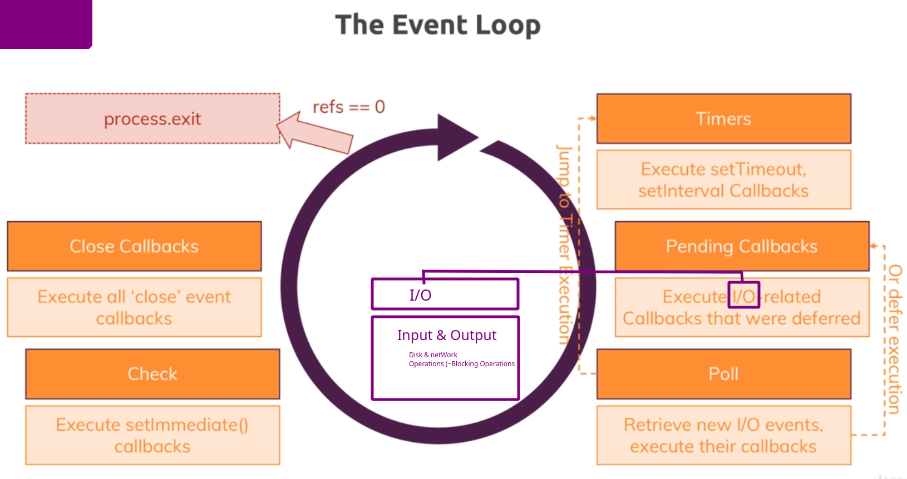

# INDEX

- [NodeJS Course](#nodejs-course)
  - [by Maximillian Academind](#by-maximillian-academind)
- [Introducción](#introducción)
  - [Como funciona la web](#como-funciona-la-web)
  - [Que es NodeJS](#que-es-nodejs)
  - [Que podemos hacer cono node](#que-podemos-hacer-cono-node)
- [T-0 JavaScript Refresh](#t-0-javascript-refresh)
  - [Sintaxi de arrow function](#sintaxi-de-arrow-function)
  - [Uso de la keyword this y utilidad de ()](#uso-de-la-keyword-this-y-utilidad-de)
  - [Objects properties methods](#objects-properties-methods)
  - [Arrays y sus métodos](#arrays-y-sus-métodos)
    - [Métodos](#métodos)
      - [map()](#map)
      - [slice()](#slice)
      - [splice()](#splice)
      - [foreach()](#foreach)
      - [push() / pop() / shift() / unshift()](#push-pop-shift-unshift)
  - [new Operators](#new-operators)
    - [spread](#spread)
    - [rest](#rest)
  - [Destructuring](#destructuring)
  - [Async code & Promises](#async-code-&-promises)
    - [Código síncrono vs asíncrono](#código-síncrono-vs-asíncrono)
    - [Promises](#promises)
- [T-1 NodeJs Basics](#t-1-nodejs-basics)
  - [Creando un servidor con NodeJS](#creando-un-servidor-con-nodejs)
    - [Creación del servidor](#creación-del-servidor)
      - [**request object**](#--request-object--)
      - [**response object**](#--response-object--)
      - [Routing request](#routing-request)
      - [Redirectign request & creating a file](#redirectign-request-&-creating-a-file)
      - [Obtener los datos del body de una request **Streams & Buffers**](#obtener-los-datos-del-body-de-una-request-**streams-&-buffers**)
    - [Lifecycle de un programa NodeJS](#lifecycle-de-un-programa-nodejs)
      - [The Event loop deeper](#the-event-loop-deeper)
  - [Usando el sistema de módulos de NodeJS](#usando-el-sistema-de-módulos-de-nodejs)
- [T2 work flow y debugging](#t2-work-flow-y-debugging)
  - [Entendiendo NPM (node package manager) scripts](#entendiendo-npm-node-package-manager-scripts)
    - [Instalando paquetes de terceros](#instalando-paquetes-de-terceros)
      - [Paquetes útiles](#paquetes-útiles)
        - [nodemon](#nodemon)
  - [Errors and debugging](#errors-and-debugging)
- [T3 ExpressJS](#t3-expressjs)
  - [Que es expressJS y para qué se utiliza](#que-es-expressjs-y-para-qué-se-utiliza)
  - [Usando express](#usando-express)
    - [Middleware](#middleware)
      - [use](#use)
      - [listen()](#listen)
    - [Manejando rutas](#manejando-rutas)
    - [Parsing incoming request](#parsing-incoming-request)
    - [usando el router de express](#usando-el-router-de-express)
    - [generar 404 error page](#generar-404-error-page)
    - [Filtrar los PATHS](#filtrar-los-paths)
    - [Servir páginas HTML](#servir-páginas-html)
      - [process.cwd()](#processcwd--)
    - [Servir archivos estáticos](#servir-archivos-estáticos)
- [T4 - Trabajando con contenido dinámico y motor de plantillas](#T4---trabajando-con-contenido-dinámico-y-motor-de-plantillas)
  - [Motor de plantillas](#motor-de-plantillas)
    - [Instalación de las plantillas](#instalación-de-las-plantillas)
      - [view engine](#view-engine)
      - [views](#views)
    - [PUG](#pug)
      - [Añadiendo contenido dinámico a la plantilla de pug](#añadiendo-contenido-dinámico-a-la-plantilla-de-pug)
      - [Añadiendo Layouts](#añadiendo-layouts)
      - [Añadir clases css de manera dinámica](#añadir-clases-css-de-manera-dinámica)
    - [HandleBars](#handlebars)
      - [Usando layouts con handlebars](#usando-layouts-con-handlebars)
    - [EJS](#ejs)
- [T-5 Patrón Modelo vista controlador - MVC -](#T-5-Patrón-Modelo-vista-controlador---MVC-)

<small><i><a href='http://ecotrust-canada.github.io/markdown-toc/'>Table of contents generated with markdown-toc</a></i></small>

# NodeJS Course

## by Maximillian Academind

> <span style="font-size:1.5em;"> [_link del curso_](https://www.udemy.com/course/nodejs-the-complete-guide/) </span>

- # Introducción

  - ## Como funciona la web
    
    Esta comunicación con el servidor se realiza utilizando unos protocolos, standarización de las rglas que tienen que seguir este tipo de comunicación. Hay varios protocolos pero los más utilizados son HTTP y HTTPs
    
  - ## Que es NodeJS

    Node.js es un entorno de tiempo de ejecución de JavaScript (de ahí su terminación en .js haciendo alusión al lenguaje JavaScript). Este entorno incluye todo lo que se necesita para ejecutar un programa escrito en JavaScript. Es la manera que tenemos de ejecutar JS fuera del navegador.
    Node aprovecha el motor V8(engine v8) de google, este permite compilar código JS en código máquina.
    Una vez instalado Node en la terminal tecleamos node y entramos en el "REPL"(Read user input, Evaluate user input, Print output, Loop wait for new input), interprete de comandos de node.

    Habitualmente Node se usa del lado del servidor.

    Aquí tenemos una petición cliente-servidor típica:
    

  - ## Que podemos hacer cono node

    Podemos construir nuestro propio servidor, aceptar peticiones y crear respuestas en forma de html, datos (json, xml, archivos) y la lógica de negocio

    

- # T-0 JavaScript Refresh

  

  Js es un lenguaje débilmente tipado, podemos usar el paradigma orintado a objetos.

  - ## Sintaxi de arrow function

    ```
    const add2 = (a, b) => {
    return a + b;
    };

    //podemos simplificar en un sola línea
    const add = (a, b) => a + b;

    // si solo tien un argumento
    const addOne = a => a + 1;

    // si no tien ningún argumento
    const addRandom = () => 1+2;
    ```

  - ## Uso de la keyword this y utilidad de ()

    - This se usa para referirnos a variables o métodos dentro de la misma clase. Si definimos una variable con this dentro de la clase ésta será accesible desde un objeto de esa clase.
      Aquí JS tiene algo curioso y es que no solo "this" hace referencia a elementos dentro de la clase si no que también hace referencia al elemento que llama a la función.

      ```
      class NameGeenerator{
          constructor(){
            const btn = document.querySelector('button');
            this.names= ['Desi','Jenni','David']          //asequible a toda la clase
            this.currentName= 0;
            btn.addEventListener('click', this.addName); //acceder a 1 método de la clase
                                                          aquí This hace referencia a la clase
                                                          xq quien llama al constructor es la clase
          }

          addName(){

            const name = new NameField(this.names[this.currentName]); // aquí this hace referencia al elemento que llama a la funcion addName q es el btn
            this.currentName++;

            if(currentName>= this.names.length){
              this.currentName= 0;
            }
          }

        }

        const gen = new NameGeenerator();
      ```

      Para cambiar este comportamiento del this debemos usar el método bind() que fija a que hace referencia el this para esa función

      ```
      btn.addEventListener('click', this.addName.bind(this)); //vuelvo a poner this xq en el
                                                                contexto del contructor quien
                                                                lo llama es la propia clase

      ```

      Otra manera de solucionar esto es usando funciones anónimas pero aquíi otra vez nos encontramos con el problema del this

      ```
      btn.addEventListener(
        "click",
        function () {
          this.addName();
        }.bind(this)
      );

      ```

      Pero la última solución propuesta x ES6 son las arrow function las cuales nos permiten conservar la referencia del this, es como si llamaramos al this fuera de esa función y por lo tanto dentro del constructor.

      ```
      btn.addEventListener("click", () => { this.addName(); } );

      ```

    - () indican que la función debe ser ejecutada de manera inmediata, así dentro de la clase cuando nos queremos referir a un método utilizamos this.nombreMetodo
      sin los "()" así sin () lo que hacemos es pasarle la referencia de esa función(la dirección de esa función).

      ```

      class NameField{
        constructor(name){
          const field = document.createElement('li');
          field.textContent = name;
          const nameListHook = document.querySelector('#names');
          nameListHook.appemdChild(field);
      }

      class NameGeenerator{
        constructor(){
          const btn = document.querySelector('button');
          btn.addEventListener('click', this.addName); // sin () para q no la ejecute inmediatamente
        }

        addName(){
          const name = new NameField('Dav');
        }

      }
      ```

  - ## Objects properties methods

    Definir un objeto:

    ```
    const person = {
      name: "David",
      age: 36,

      greet() {
        console.log("hello from " + this.name);
      },

      greet3: function () {
        console.log("hello from " + this.name);
      },

      greet2: () => {
        console.log("hi" + this.name); // aquí no debemos usar ArrowsFunction xq
                                          mantiene el scoope del elemento q llama
                                          a la función y en este caso es el object
                                          person el cual pertenece al scoope global
                                          así q no "busca dentro del objeto"
      },
    };
    ```

  - ## Arrays y sus métodos

    ```
    const miArray = ["david", "martin", 36];

    for (let items of miArray) {
      // "of" conseguimos los datos
      console.log(items);
    }

    for (let items in miArray) {
      // "in" conseguimos los índices
      console.log(items);
    }
    ```

    - ### Métodos

      - #### map()

        Convierte cada elemento del array, conservando el array original y devolviendo otro con los cambios efectuados. Por ejempo añadir a cada item un texto

        ```
        const miArray = ["david", "martin", 36];

        //1 línea
        let newArray = miArray.map((item, x) => `ìtem ${x}: ${item}`);
        //
        let newArray2 = miArray.map((item, x) => {
          return `ìtem ${x}: ${item}`;
        });

        console.log(newArray);//
        output: [ 'ìtem 0: david', 'ìtem 1: martin', 'ìtem 2: 36' ]
        ```

      - #### slice()

        para copiar arrays su contenido no la referencia así q los arryas serán independientes

        ```
        let shallowCopy = fruits.slice() // this is how to make a copy
        ```

      - #### splice()

        Eliminar items

        ```
        let vegetables = ['Cabbage', 'Turnip', 'Radish', 'Carrot']
        console.log(vegetables)
        // ["Cabbage", "Turnip", "Radish", "Carrot"]

        let pos = 1
        let n = 2

        let removedItems = vegetables.splice(pos, n)
        // this is how to remove items, n defines the number of items to be removed,
        // starting at the index position specified by pos and progressing toward the end of array.
        ```

      - #### filter()

        Nos permite generar un nuevo array siguiendo los criterios del filtro.

        ```
          const updatedroducts = products.filter((element) => element.id !== id);

        ```

        del array de productos filtramos aquellos que no tengan un id concreto, útil para el método deete by ID

      - #### foreach()
        looping arrays
        ```
        fruits.forEach(function(item, index, miArray) {
          console.log(item, index)
        })
        ```
      - #### push pop shift unshift

        ```
        let fruits = ['Apple', 'Banana']

        let newLength = fruits.push('Orange')
        // ["Apple", "Banana", "Orange"]

        let last = fruits.pop() // remove Orange (from the end)
        // ["Apple", "Banana"]

        let first = fruits.shift() // remove Apple from the front
        // ["Banana"]

        let newLength = fruits.unshift('Strawberry') // add to the front
        // ["Strawberry", "Banana"]

        ```

      - #### find and findIndex

        Nos permite obtener el valor/indice del primer elemento del array que cumple con la condición especificada
        obteniendo el índice:

        ```
        const array1 = [5, 12, 8, 130, 44];

        let x = array1.findIndex( element => element>5);
        console.log(array1[x]); // 12
        console.log( x);        // 1

        ```

        o obtener el valor

        ```
        const array1 = [5, 12, 8, 130, 44];

        let x = array1.find( element => element>5);
        console.log( x);        // 12

        ```

        si no encuentra el valor devuelve un `undefined` el índice devuelve un `-1`

  - ## new Operators

    - ### spread

      Permite sacar el contenido(propiedades/métodos/items) de un objeto/array y crear otro objeto/array según rodeemos el spread operator.
      Atención no hace un deep copy, es decir si copiamos un array/objeto que contiene otro valor por referencia no crea un nuevo objeto si no q copia la referencia (los métodos no son referencias, se mantiene independientes).

      ```

        const array1 = ["david", "martin", [36]];
        const arrayCopy = [...array1]; // lo rodeo de "[]" por lo q crea un array
        array1.push("vertgues");
        array1[0] = "david2";
        array1[2][0] = 40;

        console.log(array1);     //  [ 'david2', 'martin', [ 40 ], 'vertgues' ]
        console.log(arrayCopy); // [ 'david', 'martin', [ 40 ] ]

        no añade el último elemento pero si modifica el array anidado xq copió la referencia a este no hizo uno nuevo
      ```

      Puedo envolverlo con {} para crear un objeto

      ```
        const arrayCopy2 = { ...array1 };
        console.log(arrayCopy2); //
          {
          '0': 'david2',
          '1': 'martin',
          '2': [ 40 ],
          '3': 'vertgues'
          }
      ```

    - ### rest

      Tiene el efecto opuesto a spread, lo que hace es mergear / combinar los argumentos que le pasamos a una función en un array. También son 3 puntitos XD

      ```
      const toArray = (...args) => args;
      console.log(toArray(1, 2, 3, 5)); //[ 1, 2, 3, 5 ]

      ```

  - ## Destructuring

    Nos permite obtener los datos de un objeto / array de una manera sencilla. Se puede aplicar tanto a un objeto como a un array.

    Le paso un objeto y de ese objeto extraigo la propiedad name y age

    ```
    const person4 = {
    name: "David",
    age: 36,
    hobbies: ["nadar", "correr"],
    greet() {
      console.log("hello david");
    },
    };

    const printData = ({ name, age }) => console.log(name, age);

    ```

    También funciona fuera de las funciones y nos permite crear variables con el nombre de las propiedades de los objetos.

    ```
      const person4 = {
        name4: "David",
        age4: 36,
        hobbies4: ["nadar", "correr"],
        greet4() {
          console.log("hello david");
        }
      };

      const { name4, age4 } = person4;

      console.log(name4, age4);
    ```

    Podemos hacer destructuring de arrays y crear variables separadas, en este caso el destruturing se usa "[]" pero NO crea un array

    ```
      const array4 = ["fruta", "leche"];

      let [item1, item2] = array4;

      console.log(item1, item2);//fruta leche
    ```

  - ## Async code & Promises

    - ### Código síncrono vs asíncrono

      Un código síncrono es aquel que se ejecuta línea a línea, es decir un código síncrono es aquel código donde cada instrucción espera a la anterior para ejecutarse.

      Un código asíncrono no espera a las instrucciones diferidas y continúa con su ejecución. Por lo general la asincronía permite tener una mejor respuesta en las aplicaciones y reduce el tiempo de espera del cliente.

      ```
        //asíncrono
        setTimeout(() => {
          console.log("time done!");
        }, 2000);

        //síncrono
        console.log("2");
        console.log("1");
      ```

      el setTimeOut es como un callback, después de 2000 ms se ejecuta la función (el console.log) entonces eso es reconocido por JS y aunque el tiempo sea poco(2 s) primero ejecuta los otros console.log y después vuelve al setTimeOut.

      Si tenemos varias funciones asincronas puede ser difícil gestionarlas

      ```
        //asíncrono
        setTimeout(() => {
          console.log("time done!");
        }, 2000);

        //síncrono
        console.log("2");
        console.log("1");
      ```

    - ### Promises

      Son un objeto de JS que nos permite ejecutar código dependiendo del resultado de otra función. Por ejemplo la concexión a un API para obtener datos si la conexión es exitosa y obtenemos los datos cn la promesa ejecutamos un código y si el servidor devuelve un error ejecutamos otro código distinto.
      Las promesas se crean usando un constructor llamado Promise y pasándole una función que recibe dos parámetros, resolve y reject, que nos permiten indicarle a esta que se resolvió o se rechazó.

      ```
      const promise = new Promise((resolve, reject) => {
        const number = Math.floor(Math.random() * 10);

        setTimeout(
          () => number > 5
                    ? resolve(number)
                    : reject(new Error("Menor a 5"))
          ,1000
        );
      });

      promise
        .then((number) => console.log(number))
        .catch((error) => console.error(error));
      ```

---

- # T-1 NodeJs Basics

  - ## Creando un servidor con NodeJS

    Por defecto Node incluye una serie de módulos, los llamados core modules, algunos ejemplos son:
    

    Aunque estos módulos están incluidos alguno de ellos no están disponibles de manera global como es el caso del módulo http para ello debemos importarlo usando el keyword **require**

    - require nos permitirá:
      - importar archivos locales, para ello hay que usar un path:
        - absoluto (empezamos x la raíz del sistema de archivos "/")
        - relativo (empezamos x donde se encuentra el archivo "./")
      - importar un **global module** para ello no especificamos ningún path, sólo el nombre del módulo.
    - ### Creación del servidor

      1. importamos el global module **http**
         ```
           const http = require("http");
         ```
      2. usamos el método **createServer()**, como argumento necesita un **requestListener**, es una función tipo callback
         se ejecutará por cada conexión con el servidor (incoming request).
      3. definir los argumentos de la función requestListener, estos argumentos son dos objetos:

         - request => incoming message
         - response => respuesta del servidor  
           La función puede ser creada como función a parte, anónima o usando arrow function.

           ```
             1. Función a parte

               function rqListener(req, res) {}
               http.createServer(rqListener);

             2. anónima
               http.createServer(function (req, res) {});

             3. arrow funciton
                 http.createServer((req, res) => {console.log(req); });
           ```

      4. el método http.createServer() nos devuelve un objeto del tipo servidor.

         ```
           const server = http.createServer((req, res) => {
                         console.log(req);
                       });

         ```

      5. cn el servidor definimos, mediante el método listen(), un puerto y un
         hostname,si corremos en local por defecto es "localhost" así q no haría
         falta ponerlo.
         ```
          server.listen(3000, "localhost");
         ```

      - #### **request object**

        Es un objeto bastante complejo con multitud de información, a destacar:

        1. Headers
           - Es metadata, añadida al request y tb a response. Contiene el host
             
        2. url
        3. method

      - #### **response object**

        Con el objeto response podemos mandar datos de vuelta, para ello utilizamos diferentes métodos:

        1.  **setHeader()**
            Definimos qué tipo de datos vamos a devolver
        2.  **setWrite()**
            No es muy habitual pero nos permite escribir html
        3.  **end()**
            Para indicar que finalizamos la respuesta. siempre tenemos que agregar end() para indicar q se finaliza

            ```
                const server = http.createServer((req, res) => {

                    const url = req.url;

                    res.setHeader("Content-Type", "text/html");
                    res.write("<html>");>
                    res.write("<head><title>My Web</title></head>");
                    res.write("<body><h1>Hello world</h1></body>");
                    res.write("</html>");
                    res.end();
              });
            ```

      - #### Routing request

        Vamos a gestionar las rutas de nuestro servidor, según el end-point el server nos dará una respuesta u otra.A lo cutre pero sería algo así:

        ```
        if (url === "/") {

                    res.setHeader("Content-Type", "text/html");
                    res.write("<html>");
                    res.write("<head><title>My Web</title></head>");
                    res.write(
                    "<body>
                      <h1>Enter massage</h1>
                      <form action='/message' method='POST'>
                        <input name='message' type='text'></input>
                        <button type='submit'>Click Me!</button>
                      </form>
                    </body>"
                    );
                    res.write("</html>");
                    return res.end();

                }
        ```

      - #### Redirectign request & creating a file

        ```
          // creamos estas variable como globales, fuera del http.reateServer()
          /--------------------------
          const fs = require("fs");
          const method = req.method;
          //--------------------------

          if (url == "/message" && method === "POST") {
            const m = "nothing";
            fs.writeFileSync("message.txt", m);
            res.statusCode = 302;
            res.setHeader("Location", "/");
            return res.end();
          }

        ```

      - #### Obtener los datos del body de una request **Streams & Buffers**

        Node gestiona todos los datos del mismo modo, usando streams y buffers, es una manera muy eficiente de gestionar los datos (leer/escribir datos de entrada en una salida secuencial), son usados para leer archivos, comunicaciones en red,...
        Básicamente un stream lo que hace es partir los datos en fragmentos lo que hace que sean más manegables y que se puedan empezar a procesar a medida que vamos obteniendo estos fragmentos, en lugar de cargar todos los datos en memoria de una vez como se hacía antes.
        Es como funcionan las plataformas de "streaming" como youTube, no cargan el vido completo para poder visualizarlo sino que trocean la información y la van mandando a trozos para que estos puedan ser procesados de inmediato y el video se reproduzca al momento, creando así un flujo continuo de datos. El papel del buffer es de contenedor, a medida que vamos obteniendo trozos de datos vamos llenando el buffer(éste tiene una memoria fija), así un buffer contiene fragmentos de datos antes de empezar a procesarlos, cuando este se llena los datos empiezan a ser procesados. En el flujo continuo de datos, los buffers serían como un stop para coger ese conjunto de trozos de datos y empezar a procesarlos.  
          
        

        Para leer los datos del request, en nuestro caso datos enviados por un formulario (POST), en node todo son eventos así que para capturar los datos tenemos que implementar un **event listener** que esté pendiente de un evento tipo data, este evento es disparado por el stream cuando hay un paquete de datos (chunk) disponible, cuando el buffer está lleno, entonces podemos empezar a procesar esa parte de los datos y el stream dispara un evento 'data' y genera un chunk_of_data que es un objeto Buffer, cada uno de estos chunk_of_data los vamos metiendo en un array de tal manera q al finalizar el proceso tendremos un array de buffers. Al finalizar el proceso se emite un evento end (ya no hay más datos disponibles). Capturamos ese evento y mediante el método concat() de la clase buffer generamos un nuevo buffer a partir del array de buffers (body) y como sabemos q la info es tipo string lo casteamos a string

        ```
              const body = [];
              req.on("data", (chunk_of_data) => {
                body.push(chunk_of_data);
              });
              req.on("end", () => {
                const parsedBody = Buffer.concat(body).toString();
                const message = parsedBody.split("=")[1];
                fs.writeFile("message.txt", message, (err)=>{
                  res.statusCode = 302;
                    res.setHeader("Location", "/");
                    return res.end();
                });
              });
        ```

    - ### Lifecycle de un programa NodeJS

      En el caso de nuestro servidor(app.js), los pasos son los siguientes:

      1.  Ejecutamos el archivo => node app.js
      2.  El motor de node lee el archivo
      3.  Parsea el código, registra las variables y funciones
      4.  Entonces sucede que nuestro archivo se mantiene en ejecución gracias al **event loop**  
           4.1. Event loop es un proceso gestionado por nodeJS que gestiona los callbacks.  
           4.2. Hay que recordar que NodeJS corre en un único hilo (single threat) no se pueden ejectar varios procesos al mismo tiempo(aunque se puede modificar hasta 4 threats)  
           4.2. Event loop está formado por varias partes:

          - Tenemos un event queue, donde se almacenan los procesos a reaizar
          - cada evento es recogido x el event loop y llevado al thread pool donde es asignado a un hilo
          - En el thread pool hay un max de 4 hilos cuando están ocupados, la event queue se va llenado
          - a medida que van terminando los procesos los hilos se desocupan y event loop va cogiendo nuevos procesos de la cola
          - en nuestro caso (servidor) el event loop se queda continuamente a la escucha de nuevos request.

              
            **Siendo NodeJS un proceso monohilo como conseguimos el efecto multihilo, para ello nos servimos de las callbacks y del sistema operativo que nos provee de prcesos multihilo, entonces NodeJS recoge la tarea del event queue. pej leer fichero, y solicita al SO que realice esa función y mediante una callback nos avise cuando la haya completado, mientras nuestro hilo sigue su curso y se encuentra otra tarea, conexion cn bbdd, vuelve a solicitar al SO que haga la conexión, y así, si tuvieramos un proceso que requiere mucho poder de computación o el SO no provee ninguna interfaz asíncrona para ese proceso ya no se utiliza al SO si no que tiramos el threadPoll**  
            source: [_link del video_](https://www.youtube.com/watch?v=lGiv0zfdiJA)

      - #### The Event loop deeper

        Cómo ya hemos dicho event loop se encarga de gestionar los callbacks, en el siguiente orden:

        - En primer lugar busca si en nuestro código hay **timers** (setTimeOut/setInterval)
        - Otros callbacks pendientes tipo I/O-related como leer/escribir archivos, conexiones de red,...en general blocking long taking operation
        - en un punto de este proceso nodeJS dejará esta fase, así que si hay más callbacks pospondrá su ejecución hasta el siguiente iteración del loop
        - Una vez estas primera operaciones se completen, event loop entra en la fase poll
        - Esta fase pull es cuando nodeJS buscará nuevos I/O events
        - Si encuentra nuevos IO events hará lo posible por ejecutar sus callbacks de manera inmediata
        - Si no es posible pospondrá su ejecución y las registrará como callbacks pendientes.

        VOLVER A MIRAR EL VIDEO 14
        
        

  - ## Usando el sistema de módulos de NodeJS

    En nodeJS es muy común separar nuestro código en diferentes archivos y luego exportarlos para poderlos usar desde otros archvos y así tener nuestro código más ordenado.  
    Podemos crear un nuevo archivo llamado **routes.js** que contendrá los pasos a seguir según la url que le solicitemos al servidor, esto es la función anónima que le pasamos como argumento a **http.createServer()**. Así podemos dejar un archivo con la creación del servidor y un archivo routes dnd encontremoslas urls de éste.
    Nuestro punto de partida será el servidor (app.js) y este requerirá el código del archivo routes, para ello desde el archio routes asignamos nuestra función **(req,res)=>{}** a una constamte llamada **requestHandler** para luego poderla exportar.

    ```
    const requestHandler = (req, res) => {
      const url = req.url;
      const method = req.method;
      if (url === "/") {
        res.setHeader("Content-Type", "text/html");
        res.write("<html>");
        res.write("<head><title>My Web</title></head>");
        res.write(
          "<body><h1>Enter massage</h1> <form action='/message' method='POST'> <input name='message' type='text'></input> <button type='submit'>Click Me!</button> </form></body>"
        );
        res.write("</html>");
        return res.end();
      }

      if (url === "/message" && method === "POST") {
        const body = [];
        req.on("data", (chunk_of_data) => {
          body.push(chunk_of_data);
        });
        req.on("end", () => {
          const parsedBody = Buffer.concat(body).toString();
          const message = parsedBody.split("=")[1];
          fs.writeFileSync("message.txt", message, (err) => {
            res.statusCode = 302;
            res.setHeader("Location", "/");
            return res.end();
          });
        });
      }
      res.setHeader("Content-Type", "text/html");
      res.write("<html>");
      res.write("<head><title>My Web</title></head>");
      res.write("<body><h1>hello world</h1> </body>");
      res.write("</html>");
      res.end();
    };
    ```

    Y esta constante **requestHandler** será lo que exportemos. Lo podemos hacer de varias maneras pero siempre utilizando un objeto global de JS llamada **module** que tiene una propiedad llamada **exports** a la cual le podemos asignar un valor:

    1. Almacenar directamente la constante en la propiedad exports

    ```
      module.exports = requestHandler;

      // en app.js podríamos utilizar la constante directamente:
        const routes = require("./routes");
        const server = http.createServer(routes);

    ```

    2. exportar como un objeto

    ```
      module.exports = {
        handler: requestHandler,
        text : 'Hello world"
      }
      // en app.js tenemos q acceder a la propiedad de ese objeto:
        const routes = require("./routes");
        const server = http.createServer(routes.handler);

    ```

    2. crear propiedades dentro de exports

    ```
      module.exports.handler= requestHandler;
      module.exports.text= 'hello world';

      // en app.js tenemos q acceder a la propiedad de ese objeto:
        const routes = require("./routes");
        const server = http.createServer(routes.handler);

    ```

    Una vez hecho esto desde nuestro archivo app.js podemos importar los datos contenido en esa propiedad **exposrts** mediante un **require** y almacenar los datos en una constante. Como estamos importando un módulo que no es global necesitamos especificar el path por ello:

    ```
      const routes = require("./routes");
    ```

- # T2 work flow y debugging

  - ## Entendiendo NPM node package manager scripts

    Es un gestor de paquetes para NodeJS que se instala automáticamente cuando instalamos NodeJS. Este nos permitirá instalar paquetes de terceros no incluidos en el core de NodeJS.
    Podemos usar npm para empezar un nuevo proyecto de NodeJS. En el directorio del proyecto otecleamos en la terminal:

    ```
      npm init
    ```

    Esto nos guiará por un asistente para que completemos información sobre nuestro proyecto. Esto generará un archivo **package.json** (archivo de configuración de nuestro proyecto).

    ```
      {
        "name": "2.1-node_server",
        "version": "1.0.0",
        "description": "",
        "main": "app.js",
        "scripts": {
          "test": "echo \"Error: no test specified\" && exit 1"
        },
        "author": "David Martin",
        "license": "ISC"
      }
    ```

    Gracias a este archivo de configuración nos podemos llevar nuestro proyecto a otro pc y para instalarlo (dependencias) podemos hacer

    ```
    npm install
    ```

    Y tendremos nuestro proyecto listo

    En este archivo hay una sección de scripts, en la cual podemos definir scripts propios.

    1. start

       Este es el nombre de un script predefinido así que se ejecuta directamente **npm start** Nos permite ejecutar un comando para inicializar nuestro proyecto. Esto se utiliza cuando alguien externo quiere ejecutar nuestro proyecto y no sabe el punto de partida se suele poner "npm start" para que se ejecute.

       ```
         {
           "name": "2.1-node_server",
           "version": "1.0.0",
           "description": "",
           "main": "app.js",
           "scripts": {
             "test": "echo \"Error: no test specified\" && exit 1",
             "start": "node app.js"
           },
           "author": "David Martin",
           "license": "ISC"
         }
       ```

    2. custom name
       Para ejecutar un scrip con un nombre puesto por nosotros debemos teclear:
       ```
         npm run nombreScript
       ```

    - ### Instalando paquetes de terceros

        
      NPM repository es donde se almacenan los paquetes de terceros y mediante comandos de npm podemos instalarlos en nuestro proyecto y utilizarlos como dependencias del mismo lo que llamamos **paquetes de producción** o también hay paquetes que nos ayudan durante el desarrollo **paquetes de desarrollo**.
      Así cuando instalamos un paquete hay que decidir de que tipo es, si es dependencia de desarrollo lo instalamos como

      ```
      npm install nombrePackage --save-dev
      ```

      Si queremos instalarlo como dependencia de producción es

      ```
      npm install nombrePackage --save
      ```

      De ambas maneras solo lo instala en nuestro proyecto, si queremos instalar un paquete de manero global usamos -g

      ```
      npm install -g nombrePackage
      ```

      - #### Paquetes útiles

        1. ##### nodemon
           Nos permite reiniciar nuestro servidor cuando modificamos el código. Para instalarlo

        ```
          npm install nodemon --save-dev
        ```

        Podemos crear una archivo, nodemon.json, en la raiz del proyecto para configurar que ignore algunos archivos

        ```
          {
            "ignore": ["*.json"]
          }

        ```

        Así solo lo instalamos de manera local (solo nuestro proyecto). Nos crea en nuestro proyecto una carpeta **node_modules** donde se instalan estos paquetes.
        Para usarlo tenemos que ejecutar el proyecto mediante nodemon no usando node

        ```
          {
            "name": "2.1-node_server",
            "version": "1.0.0",
            "description": "",
            "main": "app.js",
            "scripts": {
              "test": "echo \"Error: no test specified\" && exit 1",
        /*=>*/  "start": "nodemon app.js" // <==
            },
            "author": "David Martin",
            "license": "ISC",
            "devDependencies": {
              "nodemon": "^2.0.6"
            }
          }
        ```

  - ## Errors and debugging

    Hay tres categorias de errores:

    sintaxis  
    Tiempo de ejecución => nuestro programa tiene algún error que impide que se ejecute  
    Errores de lógica => el programa se ejecuta pero no funciona como se esperaría.

- # T3 ExpressJS

  - ## Que es expressJS y para qué se utiliza

    

    Express es un framework que nos permitirá despreocuparnos de tareas tediosas, como extraer el body de la request, crear servidor, routing,... y centrarnos en la lógica.
    Por ejemplo para extraer el body de la request teníamos q escuchar el event data recorrer el buffer, detectar el event end y parsear la info a string si la info era un string... con express todo eso se simplifica.

  - ## Usando express

    1. Instalamos express

       ```
         npm install express --save
       ```

       2. importamos en nuestro app.js

       ```
         const express = require('express');
       ```

       3. creamos una app cn express y arrancamos el server

       ```
         const app = express();

         const server = http.createServer(app);

         server.listen(3000);
       ```

       - ### Middleware

         
         Express funciona con middlewares, es un conjunto de funciones a través de las cuales es conducida una request al servidor. Estos middlewares son requestHandlers mediante los cuales podemos agregar funcionalidades a nuestro servidor, son funciones que establecemos entre la entrada de la request y el envío de la respuesta.

         - #### use

           Es un método sobrecargado por lo que tenemos varias implementaciones del mismo.
           Para cada request entrante se ejecutará el método use(), a éste le pasamos tres argumentos request,response y **next**.

           - Next()
             es una función que debemos ejecutar al final de nuestro código para permitir el avance hacia el siguiente middleware. Excepto cuando enviemos una respuesta.
           - send()
             Nos permite enviar una respuesta y de manera automática exprees detecta qué tipo de respuesta es y le completa el header.
             

         - #### listen()

           esta función sustituye a la creación del servidor.

           ```
           const server = http.createServer(app);
           server.listen(3000, "localhost");
           ```

           podemos escribir directamente

           ```
             app.listen(3000);
           ```

       - ### Manejando rutas

         Podemos usar el middleware use() para especificar la url. Si solo especificamos en la ruta "/" como todas las url empiezan por '/', si queremos acceder a una url q no existe en nuestro servidor pej
         /random como el único elemento que coincide es / se dirigirá ahí. Las diferentes rutas siempre tienen que ir por encima de la principal "/". Para evitar esto podemos utilizar get(), post(),... ya que con estos métodos sólo se dirigirá si la url es exactamente igual.

         ```
         app.use("/add-product", (req, res, next) => {
           console.log("in the middleware");
           res.send("<h1>Add-product page</h1>");
         }); //middleware

         app.use("/", (req, res, next) => {
           console.log("in the other middleware");
           res.send("<h1>Hello from express</h1>");
         }); //middleware

         ```

       - ### Parsing incoming request

         Para gestionar los request usamos el middeware use() de la siguiente manera.

         1. body-parser y urlencoded()
            Es una paquete externo que instalamos en desarrollo que nos ayudará a parsear el contenido del body. Funciona solo para parsear datos codificados en la url por lo tanto tipo string, datos que vienen de un formulario, si enviamos tipo json o archivos usaremos otro tipo de **body-parser**.
            Como hemos dicho antes use() se ejecuta para cada request así q body-parser se ejecutará en cada conexión y si hay datos en la url los decodificará, lleva implícito un next() por lo que permitirá ejecutar el código que le sigue.

            ```
             npm install body-parser --save

            ```

            Una vez instalado lo importamos y especificamos que queremos decodificar las url usando el método urlencoded()
            tenemos que añadirle la opción extended en:

            - false si los datos codificados en la url serán de tipo string o array
            - true si serán de cualquier tipo

            ```
             const bodyParser = require("body-parser");

             const app = express();
             //parsear el request body
             app.use(bodyParser.urlencoded({ extended: true }));

            ```

            Para hacer que la ruta (/product) solo sea accesible mediante una petición tipo POST
            el método use() es genérico, reacciona a cualquier request si queremos filtrar r get o post debemos usar
            app.get()
            app.post()
            app.delete()
            app.push()
            app.put()

            ```
             app.post("/product", (req, res, next) => {
               console.log(req.body);
               res.redirect("/");
             });
            ```

       - ### usando el router de express

         La función Router() crea como una mini app de express asociada a nuestra app que nos ayuda a gestionar las rutas. Creamos una carpeta Routes y dentro ponemos nuestroas archivos para las rutas, normalmente se pone uno para las rutas a las q puede acceder el admin y otro genérico.

         

         ```
           const express = require("express");

           const router = express.Router();

           router.get("/add-product", (req, res, next) => {

             res.send(
               "
               <body>
                 <h1>Add-product</h1>
                   <form action='/product' method='POST'>
                     <input name='title' type='text'></input>
                     <button type='submit'>add produc t!</button>
                   </form>
               </body>
               "
             );
           });

           router.post("/product", (req, res, next) => {
             console.log(req.body);
             res.redirect("/");
           });

           router.module.exports = router;
         ```

         después importamos nuestro archivo a la app.js.

         ```
           const express = require("express");
           const bodyParser = require("body-parser");

           const app = express();

           const adminRoutes = require("./routes/admin");

           app.use(adminRoutes);
         ```

       - ### generar 404 error page

         Para generar una respuesta ante una url que no existe samos

         ```
           //------------ FIN IMPORTS ----------------
           app.use(adminRoutes);
           app.use(shopRoutes);

           app.use((req, res, next) => {
             res.status(404).send("<h1>Page not found</h1>");
           });

           app.listen(3000);

         ```

       - ### Filtrar los PATHS

         Es habitual en las apps que las url se filtren por usuario, por ejemplo "/admin/add-product" o "/admin/products" y así. Si tenemos configurado nuestros paths de esa manera podemos añadirlo a use() de la siguiente manera:

         ```
           app.use("/admin", adminRoutes);

         ```

         de tal modo que solo las url que empiezan por /admin entraran en el adminRoutes. Pero una vez dentro del archivo no debemos volver a chequear la ruta entera "/admin/add-product" solo mira a partir de
         "/admin/"

         ```
           // /admin/add-product => GET

           router.get("/add-product", (req, res, next) => {

             res.send(
               "<body><h1>Add-product</h1> <form action='/admin/add-product' method='POST'> <input name='title' type='text'></input> <button type='submit'>add produc t!</button></form></body>"
             );
           });

           // /admin/add-product => POST

           router.post("/add-product", (req, res, next) => {

             console.log(req.body);
             res.redirect("/");
           });
         ```

       - ### Servir páginas HTML

         - #### Formas de acceder al path

           - ##### process.cwd()

             Esta función es una manera de conocer la ruta absoluta donde se encuntra nuestro proyecto:

             ```
             console.log(process.cwd())
             /home/david/Programacion/WEB-DEVELOPMENT/NodeJs/code/T5-MVC/5.1-eJS-node-server
             ```

           - ##### require.main.filename

             Sustituye a process.mainModule.filename, y como este nos da el nombre del archivo donde empieza nuestra app, el que arranca la aplicación.

             ```
               console.log(require.main.filename);
               /home/david/Programacion/WEB-DEVELOPMENT/NodeJs/code/T5-MVC/5.1-eJS-node-server/app.js

             ```

           - ##### dirname

             Nos da la ruta absoluta hasta el archivo donde ejecutamos `__dirname`

             ```
               console.log(__dirname);
               /home/david/Programacion/WEB-DEVELOPMENT/NodeJs/code/T5-MVC/5.1-eJS-node-server/controllers

             ```

           Creamos un directorio llamado views dnd guardaremos nuestras págias HTML.
           Para poderlas devolver en la respuesta usamos el método sendFile() y especificamos la ruta a nuestras vistas. Para especificar el PATH tenemos un core module que nos ayuda con eso.

           ```
             const path = require("path");

             router.get("/", (req, res, next) => {

                 res.sendFile(path.join(__dirname,"..", "views", "shop.html"));

             });
           ```

           usamos el método join() para ir encadenando porciones de la ruta hasta llegar a nuestro archivo. la variable global **\_\_dirname** hace referncia a la ruta desde la raíz de nuestro SSOO hasta el archivo donde escribimos \_\_dirname, una vez ahí vamos completando la ruta. En nuestro caso tenemos q entrar en una carpeta hermana de la q ejecutamos el código así q tenemos q concatenar
           "..".

       - ### Servir archivos estáticos

       Servir archivos estáticos significa poder servir archivos que no esté gestionado por el sistema de router de express u otro middleware si no que se accede directamente por el sistema de archivos.
       En principio NodeJS bloquea el acceso al sistema de archivos pero para que el html puede acceder a una hoja CSS necesitamos hacer una excepción.
       Para ello necesitamos otro middleware usando el propio objeto de express

       ```
       app.use(express.static(path.join(__dirname, "public")));
       ```

       De este manera hará que todo el contenido del directorio **public** sea accesible.
       Cuando intentemos acceder desde el HTML para cargar el css el sistema ya situa la ruta en el directorio especificado "public" así que en el tag link ponemos

       ```
       <link rel="stylesheet" href="/css/main.css" />
       ```

       **No hay que dejarse la "/" antes de css IMPORTANTE!!!**
       Lo que hace express es que cualquier request que solicite un archivo terminado en .css, .js, imágenes, etc.. lo edirigirá al directorio especificado como archivos státicos, en nuestro caso el diretorio public.

       Mediante el mismo método podemos registrar varios directorios como fuentes de archivos estáticos.

- # T4 - Trabajando con contenido dinámico y motor de plantillas

  Hasta ahora hemos parendido a servir contenido estático lo que no es muy usual, lo habitual es que podamos modificar el contenido de nuestros HTML de manera dinámica, por ejemplo recuperando info de nuestra BBDD.
  Para simular una bbdd usaremos una array, el problema de esto es que el array es "heredado" en node para todos los usuarios que se conecten al servidor, lo que ocasiona que si un usuario modifica la info el otro tb verá esas modificaciones, lo que no es una implementación que se deba hacer, pero xa aprender a usar el motor de plantillas está bien.
  Entonces en adimin creamos el array y lo exportamos:

  ```
    const express = require("express"),
    path = require("path");

    const router = express.Router();

    //----variable donde guardaremos info a modo de bbdd
    const products = [];

   // /admin/add-product => GET
    router.get("/add-product", (req, res, next) => {
         res.sendFile(path.join(__dirname, "..", "views", "add-product.html"));
    });
    // /admin/add-product => POST
    router.post("/add-product", (req, res, next) => {
      products.push({ title: req.body.title });
      res.redirect("/");
    });

    module.exports.routes = router;
    module.exports.products = products;
  ```

  - ## Motor de plantillas

    
    Motores de platillas hay muchos pero veremos los 3 más usados. Todos ellos se integran a la perfección con express, es más es más fácil usarlos con express, solo necesitamos "decirle" a express que usaremos un motor de plantillas

    

    - ### Instalación de las plantillas

      1. Instalamos con npm los paquetes

         ```
             npm install ejs pug express-handlebars --save
         ```

      2. Coonfiguramos express para que use el motor de plantillas, para ello usamos método set() para establecer una configuración global. También podemos usar set() para establecer datos de manera global (accesible en toda la app), estos datos siempre son parejas llave-valor. Hay lgunas llaves preestablecidas como el caso q nos interesa **"views"** y **"view engine"**.

      - #### view engine
        Le dice a express que para renderizar vistas dinámicas utilice el motor de plantillas especificado.
      - #### views
        Le dice a express donde encontrar las plantillas dinámicas. Por defecto las coge en la ruta "/views"

      ```
      // datos globales
      app.set("miNombre","David");
      app.get("miNombre");//"David"

      // establecer plantillas.

      const app = express();

      app.set("view engine", "pug");
      app.set("views", "Templates");

      ```

    - ### PUG

      Es un motor que usa una versión simplificada de HTML, es muy importante respetar la identación, podemos usar css enlazados pero para aplicar una clase css a un tag HTML se utiliza la notación de punto

      ```
      <!DOCTYPE html>
      html(lang="en")
        head
          meta(charset="UTF-8")
          meta(name="viewport", content="width=device-width, initial-scale=1.0")
          title My Shop
          link(rel="stylesheet", href="/css/main.css")
          link(rel="stylesheet", href="/css/main-product.css")
        body
          header.main-header
            nav.main-header__nav
              ul.main-header__item-list
                li.main-header__item
                  a.active(href="/") Shop
                li.main-header__item
                  a.active(href="/admin/add-product") Add Product
      ```

      Para renderizar la vista debemos usar el método render(), como anteriormente ya definimos dónde guardábamos las platillas dinámicas no hace falta especificar la ruta

      ```
        router.get("/", (req, res, next) => {

          res.render("shop");

        });

      ```

      - #### Añadiendo contenido dinámico a la plantilla de pug

        Para pasar datos a la plantilla simplemente debemos agregárselos como segundo argumento de la función render(); en forma de objeto(clave-valor)

        ```
          const products = require("./admin").products;
          //---------------------------------------------

          const router = express.Router();

          router.get("/", (req, res, next) => {

            res.render("shop", { items: products, docTitle: "Shop" });
          });

        ```

        Para recuperar esos datos en la plantilla de pug usamos la sitaxi  
        `# { }`
        Recordemos que en la clave items tenemos un array (products) que contiene objetos del tipo {title:''} Entonces solo tendremos que iterar el array e ir sacando el título de cada producto

        ```
        <!DOCTYPE html>
        html(lang="en")
          head
            meta(charset="UTF-8")
            meta(name="viewport", content="width=device-width, initial-scale=1.0")
            title #{docTitle}
            link(rel="stylesheet", href="/css/main.css")
            link(rel="stylesheet", href="/css/main-product.css")
          body
            header.main-header
              nav.main-header__nav
                ul.main-header__item-list
                  li.main-header__item
                    a.active(href="/") Shop
                  li.main-header__item
                    a.active(href="/admin/add-product") Add Product
            main
              if items.length > 0
                div.grid
                    each item in items
                      article.card.product-item
                          header.card__header
                              h1.product__title #{item.title}
                          div.card__image
                              img(src="https://cdn.pixabay.com/photo/2016/03/31/20/51/book-1296045_960_720.png",
                              alt="A Book")
                          div.card__content
                              h2.product__price $19.99
                              p.product__description A very interesting book
                          div.card__actions
                              button.btn Add to Cart
              else
                h1 No products
        ```

        Un formulario quedaría así

        ```
          main
            form.product-form(action="/admin/add-product",method="POST")
                div.form-control
                  label(for="title") Title
                  input(type="text", name="title", id="title")
                button.btn( type="submit") Add Product

        ```

      - #### Añadiendo Layouts

        Si en todas nuestras páginas tenemos una estrctura similar, como nos sucede a nosotros con el header podemos hacer layouts en lugar de volver a escribirlo.
        Estos layuots podemos personalizarlos para que se ajusten a cada situación, por ejemplo hay páginas que tendrán unos estilos css diferentes, un contenido concreto,... así para crear un layout (esqueleto) y poder añadir elementos usamos los bloques `block`

        ```
        <!DOCTYPE html>
        html(lang="en")
          head
            meta(charset="UTF-8")
            meta(name="viewport", content="width=device-width, initial-scale=1.0")
            title #{title}
            link(rel="stylesheet", href="/css/main.css")
            block styles
          body
            header.main-header
              nav.main-header__nav
                ul.main-header__item-list
                  li.main-header__item
                    a(href="/") Shop
                  li.main-header__item
                    a(href="/admin/add-product") Add Product
            block content

        ```

        Lo mejor para guardar los layouts es en la misma carpeta donde tenemos las plantillas.

        

        Una vez hecho esto en la plantilla deseada utilizando la palabra reservada `extends`
        importamos el layout y con `block` inyectamos el contenido que queramos

        ```
          extends layouts/main-layout.pug

          block content
            h1 Page not found
        ```

      - #### Añadir clases css de manera dinámica

        Para ello podemos enviar un nuevo argumento en el método render() para saber si debemos añadir la clase o no.

        ```
          router.get("/add-product", (req, res, next) => {

            res.render("add-product", {

              pageTitle: "Add-Product",
              path: "/admin/add-product",

            });
          });

        ```

        luego comprobamos con un `if` en la plantilla

        ```
          a(href="/admin/add-product", class= (path=== '/admin/add-product' ? 'active' : '')  ) Add Product
        ```

    - ### HandleBars

      Este otro motor de plantillas usa HTML mezclado con código para generar la lantilla. Así que en app.use() modificamos nuestro motor pero handlebars no está incluido en el core así que tenemos q importarlo previamente y decirle a express que es un motor de plantillas

      ```
      const expressHbs = require('express-handlebars');//importamos

      app.engine("hbs", expressHbs()); // lo registramos como motor de plantillas
      app.set("views", "Templates");
      app.set("view engine", "hbs");

      ```

      Para renderizar la página tenemos que especificar q no usamos layouts porque por defecto handlebars se construye con un esquelo principal al que le vamos añadiendo cosas, entonces busca primero un main.handlebars.
      Busca por este árbol de directorios  
      

      ```
        app.use((req, res, next) => {
          res
            .status(404)
            .render("404", { layout: false, pageTitle: "Page not found2" });
        });
      ```

      Luego podemos modificar varios valores con los que trabaja handlebars por defecto

      ```
        app.engine("handlebasrs", expressHbs({
                layoutsDir: path.join(__dirname, "Templates","layouts"),
                partialsDir: path.join(__dirname, "Templates","layouts","partials"),
                extname: "hbs",
                defaultLayout: 'main',
          })
        );
      ```

      Una de las diferencias con pug es que en una plantilla de handlebars no podemos usar lógica, es decir evaluar con un if
      `if items.length > 0 ...` sólo podemos pasarle variables con datos.
      Así que la lógica la tenemos que tener en nuestro nodeJS pasarle a la plantilla el resultado

      ```
      router.get("/", (req, res, next) => {
        res.render("shop", {
          layout: false,
          pageTitle: "Shop - handlebars",
          items: products,
          hasProducts: products.length > 0,
        });
      });
      ```

      una vez sabemos si tenemos productos evaluar con if en la plantilla, cuando hacemos un loop con `each` podemos acceder a cada elemento dentro de la iteración con `this`

      ```
        {{#if hasProducts}}
                {{#each items}}
                  <div class="grid">
                      <article class="card product-item">
                          <header class="card__header">
                              <h1 class="product__title">{{this.title}}</h1>
                          </header>
                          <div class="card__image">
                              
                          </div>
                          <div class="card__content">
                              <h2 class="product__price">$19.99</h2>
                              <p class="product__description">A very interesting book about so many even more interesting things!</p>
                          </div>
                          <div class="card__actions">
                              <button class="btn">Add to Cart</button>
                          </div>
                      </article>
                  </div>
                {{/each}}
              {{else}}
                <h1>Not found products</h1>
              {{/if}}

      ```

      - #### Usando layouts con handlebars

        Tenemos que especificar dónde están guardadas los layouts y como se llama el layout por defecto

        ```
          app.engine(
            "hbs",
            expressHbs({
              defaultLayout: "main-layout",
              layoutsDir: path.join(__dirname, "Templates", "layouts"),
              extname: "hbs",
            })
          );

        ```

        Creamos nuestro layout, en la regióm `{{{body}}}` es donde inyectará la página que estamos renderizando

        ```
          <!DOCTYPE html>
          <html lang="en">
            <head>
              <meta charset="UTF-8" />
              <meta name="viewport" content="width=device-width, initial-scale=1.0" />
              <meta http-equiv="X-UA-Compatible" content="ie=edge" />
              <title>{{pageTitle}}</title>
              <link rel="stylesheet" href="/css/main.css" />
              {{#if formsCss}}
                <link rel="stylesheet" href="/css/forms.css" />
              {{/if}}
              {{#if productCss}}
                <link rel="stylesheet" href="/css/main-product.css" />
              {{/if}}
            </head>

            <body>
              <header class="main-header">
                <nav class="main-header__nav">
                  <ul class="main-header__item-list">
                    <li class="main-header__item"><a class= " {{#if activeShop}}active{{/if}}" href="/">Shop</a></li>
                    <li class="main-header__item">
                      <a class= "{{#if activeAddProduct}}active{{/if}} " href="/admin/add-product">Add Product</a>
                    </li>
                  </ul>
                </nav>
              </header>
              {{{body}}}
            </body>
          </html>

        ```

        Una vez hecho esto en shop.js queda así

        ```
        router.get("/", (req, res, next) => {
          res.render("shop", {
            productCss: true,
            activeShop: true,
            pageTitle: "Shop - handlebars",
            items: products,
            hasProducts: products.length > 0,
          });
        });
        ```

    - ### EJS

      Es parecido a Pug por lo q no necesitamos registrarlo como motor de plantillas. No es compatible con layouts.  
      Para crear la plantilla podemos usar HTML

      ```
      <%= %> nos permite renderizar el contenido de una variable como si fuera un string

      <%  %> en medio podemos incluir código JS
      <%- %> permite enderizar código como HTML o  hacer includes
            <%- include('../includes/navigation.ejs') %>

      ```

      Si quisiera pasar algún dato al include uso un segundo argumento

      **mirar la sintaxis de los archivos del T4**

# T-5 Patrón Modelo vista controlador - MVC -


Es un patrón de diseño que separa nuestro código en diferentes partes, cada una de ellas tiene una función concreta. Nuestra app está formada por tres partes:

- **modelo** => es la parte responsable de la gestión de los datos.
- **la vista** => se encarga de mostrar el contenido al usuario.
- **el controlador** =>responsable de conectar el modelo con las vistas, controla qué vista se renderiza, las rutas y que modelo se usa.


**mirar código del T5**
En el archivo 'T5-MVC/5.1-eJS-node-server/model/product.js' cuando leemos el archivo para almacenar los productos lo podemos hacer directamente (readFile()) o si el archivo es muy grande leerlo como un stream (a trozos).

- Refectoring usando una helper function que lea el archivo bbdd.

  ```
    const fs = require("fs"),
      path = require("path");

    const path_to_bbdd_file = path.join(
      process.cwd(),
      "data",
      "products_bbdd.json"
    );
    //---------helper function
    const getProductsFromFile = (cb) => {
      fs.readFile(path_to_bbdd_file, (err, data) => {
        if (err) {
          cb([]);
        } else {
          cb(JSON.parse(data));
        }
      });
    };
    //-----------------------
    module.exports.classProduct = class Product {
      constructor(title) {
        this.title = title;
      }
      save() {
        getProductsFromFile((products_data) => {
          products_data.push(this);
          fs.writeFile(path_to_bbdd_file, JSON.stringify(products_data), (err) => {
            if (err) console.log(err);
          });
        });
      }
      static fetchAll(cb) {
        getProductsFromFile(cb);
      }
    };

  ```

# T-6 Enhancing app

`mirar el código`

# T-7 Dynamic routes and advanced models


- Extaer con Router() datos de la url, para ello en el router usamos la siguiente nomenglatura

```
router.get("/products/:productId", shopController.getProduct);
```

Si tenemos otro segmento statico en la ruta `/products/` como por ejemplo `/products/delete` y lo ponemos detrás de la url con segmento dinámico express no podra acceder, es decir en este orden

```
//-- ESTO NO FUNCIONA BIEN !!!!!!

//url con segmento dinámico marcado por  ":"
router.get("/products/:productId", shopController.getProduct);
router.get("/products/delete", shopController.deleteProduct);

```

Este sería el orden correcto!

```
//-- ORDEN CORRECTO !!!!!!

//url con segmento dinámico marcado por  ":"
router.get("/products/delete", shopController.deleteProduct);
router.get("/products/:productId", shopController.getProduct);

```

Recordar que para pasar datos por post podemos usar el `req.body` o meter la info en la url como un `segmento dinámico (/products/:id)` y recogerlo como req.params.id

- Query params
  Son los datos que pasamos por la url, se indican a partir de un `? ` en la url y si pasamos más de uno van separados por `&`
  ```
    http://localhost:3000/admin/edit-product/0.12?myParam=true&title=book
  ```
  Hay que tener en cuenta que los datos extarídos así siempre son del tipo `string`
  Para extraerlos:
  ```
    req.query.myParam
  ```
  Si no se encuentra el parámetro que buscamos nos dvuelve `undefined`
